## Regression with Multiple Input Variables

### Table of Contents

- [Lecture 1: Multiple Features](#lecture-1-multiple-features)

  - [Introduction](#introduction)
  - [Notation](#notation)
  - [Training sets](#training-sets)
  - [Multiple Linear Regression Model](#multiple-linear-regression-model)
    - [Previous (single feature)](#previous-single-feature)
    - [Now (with multiple features – 4 features shown)](#now-with-multiple-features--4-features-shown)
    - [General (n features)](#general-n-features)
  - [Example and interpretation](#example-and-interpretation)
  - [Dot product refresher](#dot-product-refresher)
  - [Vector Notation](#vector-notation)
    - [Parameters](#parameters)
    - [Features](#features)
    - [Model in Vector Form](#model-in-vector-form)
    - [Dot Product Expansion](#dot-product-expansion)
  - [Key Points](#key-points)
  - [Terminology](#terminology)

- [Lecture 2: Vectorization Part 1](#lecture-2-vectorization-part-1)

  - [Overview](#overview)
  - [Example setup](#example-setup)
  - [Without vectorization](#without-vectorization)
  - [With vectorization](#with-vectorization)
  - [Why vectorization is faster](#why-vectorization-is-faster)
  - [Key takeaways](#key-takeaways)

- [Lecture 3: Vectorization — Part 2](#lecture-3-vectorization--part-2)

  - [Introduction](#introduction-1)
  - [Without vectorization (sequential)](#without-vectorization-sequential)
  - [Vectorized execution (parallel)](#vectorized-execution-parallel)
  - [Visual Explanation](#visual-explanation)
  - [Vectorization in multiple linear regression](#vectorization-in-multiple-linear-regression)
  - [Why Vectorization Matters](#why-vectorization-matters)
  - [Practice with NumPy](#practice-with-numpy)
  - [Key takeaways — L3](#key-takeaways--l3)
  - [Visualization: timeline](#visualization-timeline)

- [Lecture 4: Gradient Descent for Multiple Linear Regression](#lecture-4-gradient-descent-for-multiple-linear-regression)

  - [Overview](#overview-1)
  - [Multiple Linear Regression in Vector Form](#multiple-linear-regression-in-vector-form)
  - [Vector notation refresher](#vector-notation-refresher)
  - [Model and cost (vector form)](#model-and-cost-vector-form)
  - [Gradient descent updates](#gradient-descent-updates)
  - [What’s different vs one feature](#whats-different-vs-one-feature)
  - [From One Feature → Multiple Features](#from-one-feature--multiple-features)
  - [Alternative: Normal equation](#alternative-normal-equation)
  - [Practice pointers](#practice-pointers)

- [Lecture 5: Feature Scaling Part 1](#lecture-5-feature-scaling-part-1)

  - [Introduction](#introduction-2)
  - [Why scaling helps](#why-scaling-helps)
  - [Example: House Price Prediction](#example-house-price-prediction)
  - [Parameter Choice and Effect](#parameter-choice-and-effect)
    - [Case 1: Large w1, small w2](#case-1-large-w1-small-w2)
    - [Case 2: Small w1, large w2](#case-2-small-w1-large-w2)
  - [Insight: Feature Ranges Affect Parameter Size](#insight-feature-ranges-affect-parameter-size)
  - [Effect on Gradient Descent](#effect-on-gradient-descent)
    - [Scatter Plot of Features](#scatter-plot-of-features)
    - [Contour Plot of Cost Function](#contour-plot-of-cost-function)
  - [Feature Scaling](#feature-scaling)
    - [Idea](#idea)
    - [Effect](#effect)
  - [Raw vs Scaled Features](#raw-vs-scaled-features)
  - [Effect on the Cost Landscape](#effect-on-the-cost-landscape)
  - [Impact on Gradient Descent](#impact-on-gradient-descent)
  - [Key Takeaways](#key-takeaways)

- [Lecture 6: Feature Scaling Part 2](#lecture-6-feature-scaling-part-2)

  - [Overview](#overview-2)
  - [Why Scaling?](#why-scaling)
  - [Methods of Feature Scaling](#methods-of-feature-scaling)
    - [1. Divide by max](#1-divide-by-max)
    - [2. Mean normalization](#2-mean-normalization)
    - [3. Z-score Normalization (Standardization)](#3-z-score-normalization-standardization)
  - [What ranges are acceptable?](#what-ranges-are-acceptable)
  - [When to Rescale?](#when-to-rescale)
  - [Visual Intuition](#visual-intuition)
  - [Key Takeaways](#key-takeaways-1)

- [Lecture 7: Checking Gradient Descent for Convergence](#lecture-7-checking-gradient-descent-for-convergence)
  - [Overview](#overview-3)
  - [Why Check Convergence?](#why-check-convergence)
  - [Learning Curve](#learning-curve)
  - [What to Expect When It’s Working](#what-to-expect-when-its-working)
  - [Automatic Convergence Test (ε)](#automatic-convergence-test-ε)
  - [How Many Iterations?](#how-many-iterations)
  - [Key Takeaways](#key-takeaways-2)

<!-- When you add Lecture 2, Lecture 3, ... follow the same pattern:

## Lecture N: Title
- Add a corresponding section heading below in the document
- Then add links here in the TOC like:
- [Lecture N: Title](#lecture-n-title)
  - [Introduction](#introduction-n)
  - [Notation](#notation-n)
  - ... etc.

You can create unique anchors by appending -n to subsection ids (e.g., #introduction-2) to avoid collisions across lectures. -->

### Lecture 1: Multiple Features

### Introduction

- Linear regression can be extended to handle **multiple features** (not just one).
- Instead of using only one feature (e.g., house size), we can use more:
  - Number of bedrooms
  - Number of floors
  - Age of the home

This provides more information for predicting the **target** (e.g., house price).

- **Big idea**: Extend linear regression from a single feature (univariate) to many features (multiple linear regression) to make predictions more accurate and models more expressive.


### Notation

| Size in ft² x<sub>1</sub> | Bedrooms x<sub>2</sub> | Floors x<sub>3</sub> | Age (years) x<sub>4</sub> | Price ($) in 1000's (y) |
| ------------------------- | ---------------------- | -------------------- | ------------------------- | ----------------------- |
| 2104                      | 5                      | 1                    | 45                        | 460                     |
| 1416                      | 3                      | 2                    | 40                        | 232                     |
| 1534                      | 3                      | 2                    | 30                        | 315                     |
| 852                       | 2                      | 1                    | 36                        | 178                     |

```math
\begin{aligned}
\text{Features: } & x_1, x_2, \dots, x_n,\quad n \text{ is the number of features} \\
\text{Training example: } & \vec{x}^{(i)} = [x^{(i)}_1, x^{(i)}_2, \dots, x^{(i)}_n] \\
\text{Single feature value: } & x^{(i)}_j \\
\text{Parameter vector: } & \vec{w} = [w_1, w_2, \dots, w_n],\quad b \in \mathbb{R}
\end{aligned}
```

Example (housing):

- $\vec{x}^{(2)} = [1416, 3, 2, 40]$ means size=1416, bedrooms=3, floors=2, age=40.
- $x^{(2)}_3 = 2$ (the third feature—number of floors—of example 2).

### Training sets

Univariate training set (single feature):

| Size in ft² (\(x\)) | Price ($) in 1000's (\(y\)) |
| ------------------- | --------------------------- |
| 2104                | 400                         |
| 1416                | 232                         |
| 1534                | 315                         |
| 852                 | 178                         |

Multiple features training set:

| Size in ft² \(x_1\) | Bedrooms \(x_2\) | Floors \(x_3\) | Age (years) \(x_4\) | Price ($) in 1000's (\(y\)) |
| ------------------- | ---------------- | -------------- | ------------------- | --------------------------- |
| 2104                | 5                | 1              | 45                  | 460                         |
| 1416                | 3                | 2              | 40                  | 232                         |
| 1534                | 3                | 2              | 30                  | 315                         |
| 852                 | 2                | 1              | 36                  | 178                         |

### Multiple Linear Regression Model

- **Expanded form**:

```math
f_{\vec{w},b}(\vec{x}) = w_1 x_1 + w_2 x_2 + \cdots + w_n x_n + b
```

- **Compact (vector) form**:

```math
f_{\vec{w},b}(\vec{x}) = \vec{w} \cdot \vec{x} + b
```

where $\vec{w} \cdot \vec{x}$ is the **dot product**.

#### Previous (single feature)

```math
f_{w,b}(x) = wx + b \quad \text{(univariate)}
```

#### Now (with multiple features – 4 features shown)

```math
f_{w,b}(x) = w_1 x_1 + w_2 x_2 + w_3 x_3 + w_4 x_4 + b
```

#### General (n features)

```math
f_{\vec{w},b}(\vec{x}) = \sum_{j=1}^{n} w_j x_j + b \quad \text{(multiple features)}
```

```math
\vec{w} = [w_1, w_2, \dots, w_n], \quad \vec{x} = [x_1, x_2, \dots, x_n]
```

```math
f_{\vec{w},b}(\vec{x}) = \vec{w} \cdot \vec{x} + b, \quad \text{where} \quad \vec{w} \cdot \vec{x} = \sum_{j=1}^{n} w_j x_j
```


### Example and interpretation

```math
f_{\vec{w},b}(\vec{x}) = 0.1\,x_1 + 4\,x_2 + 10\,x_3 - 2\,x_4 + 80
```

Interpretation:

- \( b = 80 \): Base price = $80,000.
- \( 0.1x_1 \): Each sq. ft. adds $100.
- \( 4x_2 \): Each bedroom adds $4,000.
- \( 10x_3 \): Each floor adds $10,000.
- \( -2x_4 \): Each year of age decreases value by $2,000.

### Dot product refresher

- For vectors \(\vec{w}\) and \(\vec{x}\):

```math
\begin{aligned}
\vec{w} \cdot \vec{x} &= \sum_{j=1}^{n} w_j x_j = w_1 x_1 + w_2 x_2 + \cdots + w_n x_n \\
f_{\vec{w},b}(\vec{x}) &= \vec{w} \cdot \vec{x} + b
\end{aligned}
```


### Vector Notation

#### Parameters

```math
\vec{w} = [w_1, w_2, \dots, w_n] \text{→
weight vector (model parameters).}\newline
b = \text{bias (a single number).} b \in \mathbb{R}
```

#### Features

```math
\vec{x} = [x_1, x_2, \dots, x_n] →
\text{feature vector (input data).}
```

#### Model in Vector Form

```math
f_{\vec{w},b}(\vec{x}) = \vec{w} \cdot \vec{x} + b
```

#### Dot Product Expansion

```math
\vec{w} \cdot \vec{x} = w_1 x_1 + w_2 x_2 + w_3 x_3 + \dots + w_n x_n
```

### Key Points

- Multiple linear regression uses many input features to predict a single output.
- This model is called **Multiple Linear Regression**.
- Note: "Multivariate regression" means predicting **multiple outputs**, which is **not the same thing**.
- Using **vectorization** makes implementation simpler and faster.

### Terminology

- **Multiple linear regression**: linear regression with multiple input features.
- **Univariate regression**: linear regression with a single feature.
- Note: The term “multivariate regression” refers to something else (predicting multiple outputs) and is not used here.

## Lecture 2: Vectorization Part 1

### **Overview**

- Vectorization makes ML code both shorter and much faster by using optimized linear algebra routines (like NumPy) and parallel hardware (CPU SIMD, GPU).
- Goal: replace explicit per-element operations/loops with math operations on whole vectors/matrices.

### Example setup

```math
\vec{w} = [w_1, w_2, w_3], \quad b \in \mathbb{R}, \quad \vec{x} = [x_1, x_2, x_3], \quad n=3
```

- In math, indices often start at 1: \(w_1, w_2, w_3\); in Python/NumPy arrays start at 0: `w[0]`, `w[1]`, `w[2]`.

### Without vectorization

Mathematical form using a summation:

```math
f_{\vec{w},b}(\vec{x}) =  w_1 x_1 + w_2 x_2 +w_3 x_3 + b
```

```math
f_{\vec{w},b}(\vec{x}) = \sum_{j=1}^{n} w_j x_j + b
```

#### Python (manual multiplication)

```
f = w[0]*x[0] + w[1]*x[1] + w[2]*x[2] + b
```

#### Python (using loop)

Naive code (explicit loop; Python ranges are 0..n-1):

```python
f = 0.0
for j in range(0, n):
    f = f + w[j] * x[j]
f = f + b
```

This works but scales poorly when n is large (e.g., 100k).

### With vectorization

Use the dot product for the same computation in one line:

```math
f_{\vec{w},b}(\vec{x}) = \vec{w} \cdot \vec{x} + b
```

```python
f = np.dot(w, x) + b
```


### Why vectorization is faster

NumPy’s dot function is implemented in optimized linear algebra libraries.
These libraries can:

- Use parallel hardware (multi-core CPUs or GPUs).
- Perform computations much faster than Python loops.

This becomes especially important when working with large datasets and high-dimensional features.

### Key takeaways

- Vectorization = shorter code + faster execution.
- Avoid writing manual loops for mathematical operations when possible.
- Use libraries like NumPy to take advantage of optimized, parallelized operations.
- Practice writing `np.dot(w, x) + b` instead of manual summations.

---

## Lecture 3: Vectorization — Part 2

### Introduction

When I first learned about **vectorization**, it felt like a magic trick. The same algorithm, when vectorized, ran **much faster** than the unvectorized version.

- Without vectorization → operations happen **step by step (sequential)**.
- With vectorization → operations happen **in parallel**, using **optimized hardware**.

This difference is a **game‑changer** in machine learning, especially for **large datasets** and **complex models**.

### Without vectorization (sequential)

A simple **for loop** runs each calculation **one at a time**.

- A for-loop like

```python
f = 0
for j in range(0, 16):
    f += w[j] * x[j]
```

- At t<sub>0</sub>, compute f + w[0] × x[0].
- At t<sub>1</sub>, compute f + w[1] × x[1].
- ...
- At t<sub>15</sub>, compute f + w[15] × x[15]. Performs one multiply‑add per step at times (t<sub>0</sub>, t<sub>1</sub>, ... , t<sub>15</sub>). This is sequential: one after another.

This means 16 separate steps are needed.
Inefficient for large 𝑛 (e.g., thousands of features).


### Vectorized execution (parallel)

Vectorization uses **specialized hardware** to perform many operations **simultaneously**.

```python
import numpy as np
f = np.dot(w, x)  # vectorized dot product
```

- Multiplications w[j]×x[j] for all 𝑗 happen in **parallel**.
- Then, hardware efficiently **sums them up in one step**.

- Using **np.dot(·,·)**, hardware multiplies all pairs (w<sub>j</sub>, x<sub>j</sub>) at once, then **reduces** (adds) them efficiently.

```math
f_{\vec{w},b}(\vec{x}) = \vec{w} \cdot \vec{x} + b
```


### Visual Explanation

#### Without Vectorization

- Computations happen **one after another**.
- Each loop step **updates the result**.

#### With Vectorization

- All multiplications are done **in parallel**.
- Results are added together **efficiently**.

### Vectorization in multiple linear regression

Suppose we are updating 16 parameters

```math
\vec{w}  = (w_1, w_2, \dots, w_{16})
```

with derivative vector

```math
\vec{d}  = (d_1, d_2, \dots, d_{16})
```

,
and learning rate **α = 0.1**.

#### Without vectorization (loop)

```python
for j in range(0, 16):
    w[j] = w[j] - 0.1 * d[j]
```

- Updates each parameter **one at a time**.

#### With vectorization (all at once)

```python
w = w - 0.1 * d
```

- Updates **all parameters in parallel**.
- Behind the scenes, **NumPy** uses optimized hardware to do this **in one step**.

This speed‑up becomes crucial with **thousands of features** and **large datasets**.
It can mean the difference between:

- Training in **minutes** vs training in **hours**


### Why Vectorization Matters

- **Efficiency** → Vectorized code allows computations to **scale seamlessly** to very large datasets.
- **Parallelism** → Leverages the power of **multi-core CPUs** and **GPUs** for simultaneous operations.
- **Cleaner Code** → Eliminates unnecessary loops, making code **shorter, simpler, and easier to read**.
- **Performance Boost** → Runs **10x to 100x faster** than traditional loop-based implementations.

### Practice with NumPy

- Create vectors as **NumPy arrays**, use `np.dot` for dot products, time vectorized vs looped code to observe speedups.

### Key takeaways — L3

- Vectorization turns many scalar ops into a few high-level array ops.
- Same math, but far fewer Python steps and better hardware utilization.
- The benefit grows with dimensionality (n) and dataset size.

### Visualization: timeline


---

## Lecture 4: Gradient Descent for Multiple Linear Regression

### Overview

Now that we’ve learned about **gradient descent**, **multiple linear regression**, and **vectorization**, let’s put them all together.  
This gives us an efficient way to train a **multiple linear regression model**.

- We combine: **multiple linear regression** + **vectorization** + **gradient descent**.
- Treat parameters as a vector $\vec{w}$ and bias as a scalar $b$ to write concise math and fast code.

### Multiple Linear Regression in Vector Form

Instead of treating each parameter $w_1, w_2, \dots, w_n$ separately, we **collect them into a single vector**:

- **$\vec{w}$** = vector of parameters (length \(n\)).
- **$b$** = bias term (a single number).
- The prediction function can be written as:

```math
f_{\vec{w},b}(\vec{x}) = \vec{w} \cdot \vec{x} + b
```

```math
\vec{w} = [w_1, \dots, w_n], \quad b \in \mathbb{R}, \quad \vec{x} = [x_1, \dots, x_n]
```

- The **cost function** is written as:

```math
J(\vec{w}, b) = \frac{1}{2m} \sum_{i=1}^{m} \Big( f_{\vec{w},b}(\vec{x}^{(i)}) - y^{(i)} \Big)^2
```

So instead of writing cost as a function of many separate $w_j$’s, we write it more compactly with the **parameter vector** $\vec{w}$ and the scalar $b$.


### Vector notation refresher

```math
\vec{w} = [w_1, \dots, w_n], \quad b \in \mathbb{R}, \quad \vec{x} = [x_1, \dots, x_n]
```

### Model and cost (vector form)

```math
f_{\vec{w},b}(\vec{x}) = \vec{w} \cdot \vec{x} + b
```

Cost (using m training examples):

```math
J(\vec{w}, b) = \frac{1}{2m} \sum_{i=1}^{m} \Big( f_{\vec{w},b}(\vec{x}^{(i)}) - y^{(i)} \Big)^2
```

### Gradient descent updates

Repeat until **convergence**:

```math
w_j \leftarrow w_j - \alpha \, \frac{\partial}{\partial w_j} J(\vec{w}, b) \quad (j = 1, \dots, n)
```

```math
b \leftarrow b - \alpha \, \frac{\partial}{\partial b} J(\vec{w}, b)
```

Where the partial derivatives are:

```math
\frac{\partial}{\partial w_j} J(\vec{w}, b) = \frac{1}{m} \sum_{i=1}^{m} \Big( f_{\vec{w},b}(\vec{x}^{(i)}) - y^{(i)} \Big) x^{(i)}_j
```

```math
\frac{\partial}{\partial b} J(\vec{w}, b) = \frac{1}{m} \sum_{i=1}^{m} \Big( f_{\vec{w},b}(\vec{x}^{(i)}) - y^{(i)} \Big)
```


### What’s different vs one feature

- The error term is still \( f(\vec{x}) - y \).
- Each step updates all \(w_j\) (for j = 1…n) using their corresponding feature \(x^{(i)}\_j\).
- Vectorization lets you compute all partial derivatives and updates **in parallel**.

### From One Feature → Multiple Features

- With **one feature**, we only had one update rule for \( w \) and one for \( b \).
- With **multiple features**, we now have \( n \) parameters:
  - Update \( w_1, w_2, ..., w_n \).
  - Update \( b \) as before.

The error term is still:

```math
(f_{\vec{w}, b}(\vec{x}) - y)
```

but now it multiplies with **each input feature** \( x_j \) when updating \( w_j \).

### Alternative: Normal equation

- Solves for \(\vec{w}, b\) in one shot (no iterations), but:
  - Only applies to **linear regression**; doesn’t generalize to other models (e.g., logistic regression, neural nets).
  - Can be **slow** when number of features is very large.
  - Often hidden behind the scenes in some ML libraries’ linear regression implementations.


### Practice pointers

- Use **NumPy** for vectorized predictions, cost, and gradients.
- If NumPy syntax feels new, revisit the earlier vectorization lab for a refresher.
- Choose **learning rate (α)** and apply feature scaling to make gradient descent converge faster.

---

## Lecture 5: Feature Scaling Part 1

### Introduction

- **Goal:** Improve performance of **Gradient Descent** by using **Feature Scaling**.
- **Problem:** When features have very different **ranges**, gradient descent converges **slowly**.

### Why scaling helps

- Features with very different ranges (e.g., $x_1$: 300–2000 ft² vs $x_2$: 0–5 bedrooms) lead to **skewed cost contours** and **slow gradient descent**.
- Scaling puts features on **comparable ranges** (e.g., 0–1), improving step efficiency and convergence speed.

### Example: **House Price** Prediction

- Predicting **house price** using:
  - `x1`: Size of house (square feet), range **300–2000**
  - `x2`: Number of bedrooms, range **0–5**

#### Training Example

- House:
  - `x1 = 2000`, `x2 = 5`
  - Actual price = **$500,000**

### Parameter Choice and **Effect**

#### Case 1: **Large** `w1`, **small** `w2`

- `w1 = 50`, `w2 = 0.1`, `b = 50`
- Predicted price:

$$
price = 50 \times 2000 + 0.1 \times 5 + 50
$$

$$
= 100,000k + 0.5k + 50k = 100,050.5k \ (\approx \$100M)
$$

❌ Very far from the actual price.

#### Case 2: **Small** `w1`, **large** `w2`

- `w1 = 0.1`, `w2 = 50`, `b = 50`
- Predicted price:

$$
price = 0.1 \times 2000 + 50 \times 5 + 50
$$

$$
= 200k + 250k + 50k = 500k
$$

✅ Much more reasonable (matches actual price).

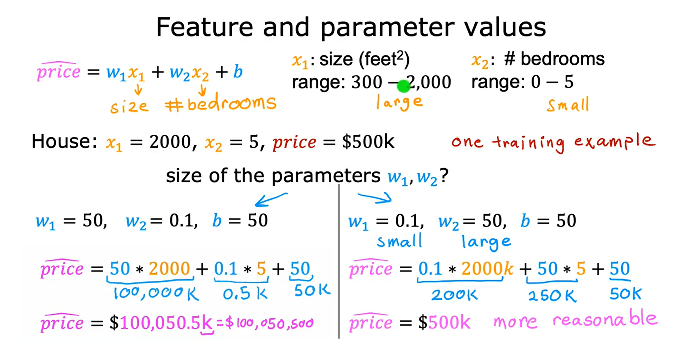

### Insight: **Feature Ranges** Affect **Parameter Size**

- **Large range feature (size in sq. ft.)** → Small parameter value (`w1 ≈ 0.1`)
- **Small range feature (# of bedrooms)** → Large parameter value (`w2 ≈ 50`)

  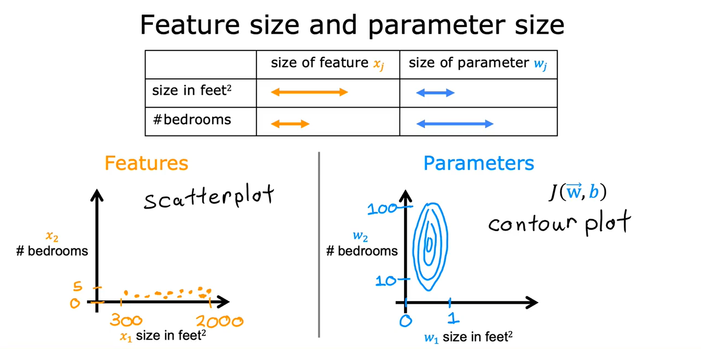

### Effect on **Gradient Descent**

#### Scatter Plot of **Features**

- `x1` has a wide range (300–2000)
- `x2` has a narrow range (0–5)

#### Contour Plot of **Cost Function**

- Contours look like **elongated ellipses**
- Why?
  - Small changes in `w1` → large effect on cost `J(w,b)`
  - Large changes in `w2` needed to affect cost

⚠️ Gradient descent struggles:

- Steps “bounce” back and forth (zig-zag path).
- Convergence is **slow**.

### **Feature Scaling**

#### **Idea**

- Transform features so they all take on **comparable ranges of values**.
- Example: Scale both `x1` and `x2` into the range **0–1**.

#### **Effect**

- Contours of cost function become **more circular**.
- Gradient descent finds a **direct path** to the minimum.
- ✅ Convergence becomes **much faster**.

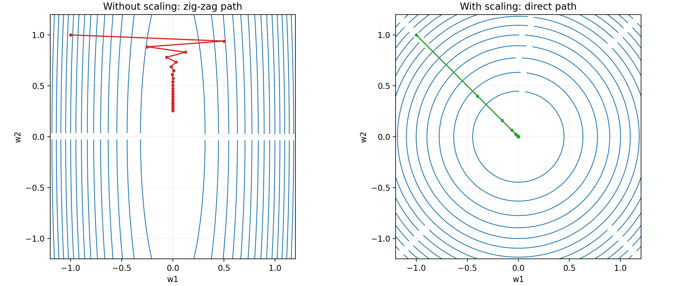

### **Raw vs Scaled Features**

- Example house: $x_1=2000$, $x_2=5$, price $=500$k.
- Parameter intuition:

  - When a feature’s range is **large**, its parameter tends to be **small** (e.g., $w_1\approx 0.1$ for size).
  - When a feature’s range is **small**, its parameter can be **large** (e.g., $w_2\approx 50$ for bedrooms).

  | Row Feature                                         | Scaled Feature                                            |
  | --------------------------------------------------- | --------------------------------------------------------- |
  | 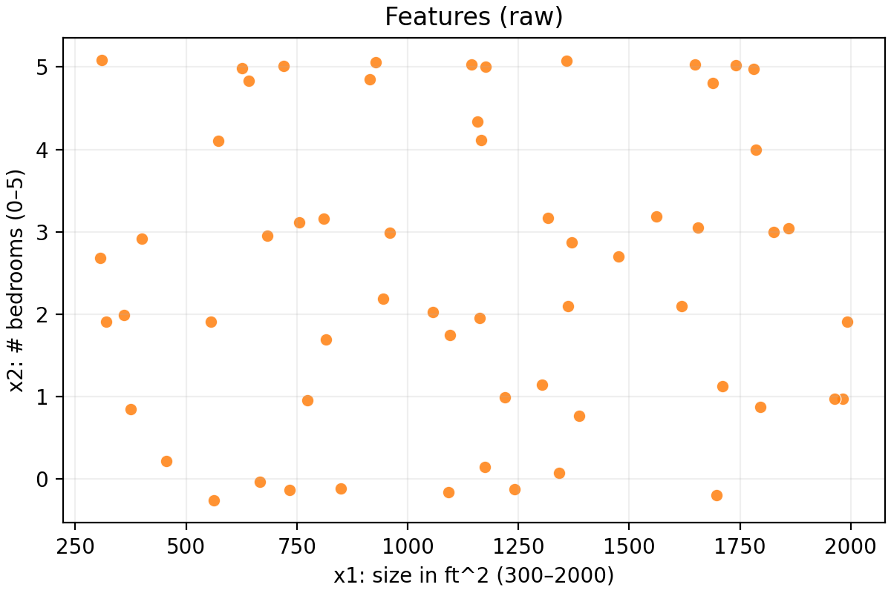 | 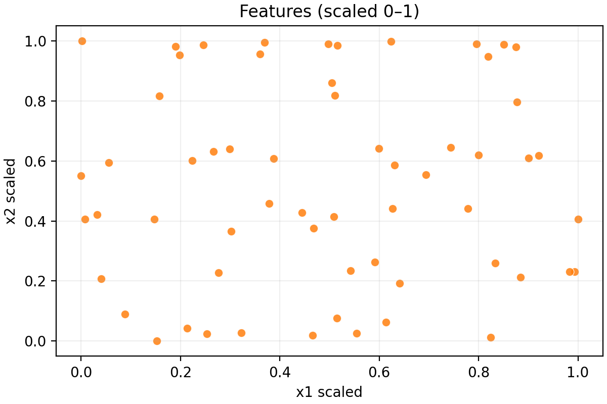 |

### Effect on the **Cost Landscape**

- Before scaling: cost contours are **tall and skinny ellipses** (very sensitive to $w_1$, less to $w_2$).
- After scaling: contours become **more circular**, so descent can head **straight to the minimum**.

| Contours before scaling                                           | Contours after scaling                                          |
| ----------------------------------------------------------------- | --------------------------------------------------------------- |
| 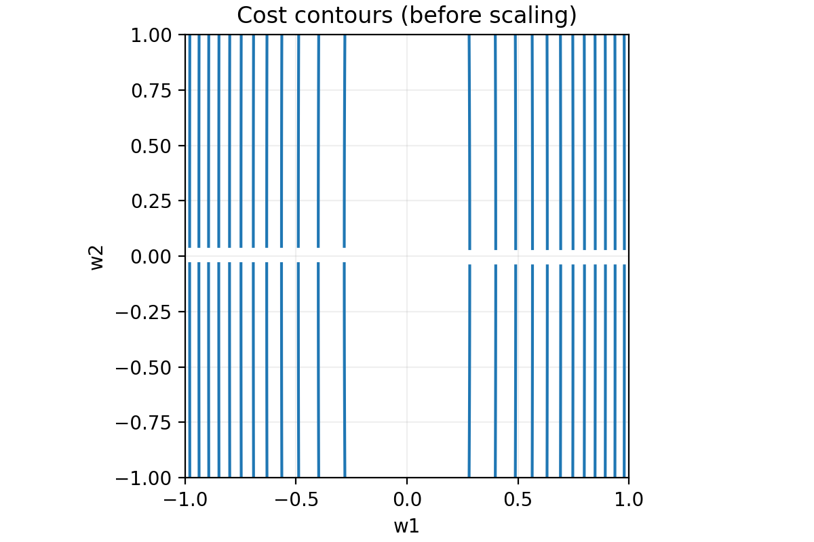 | 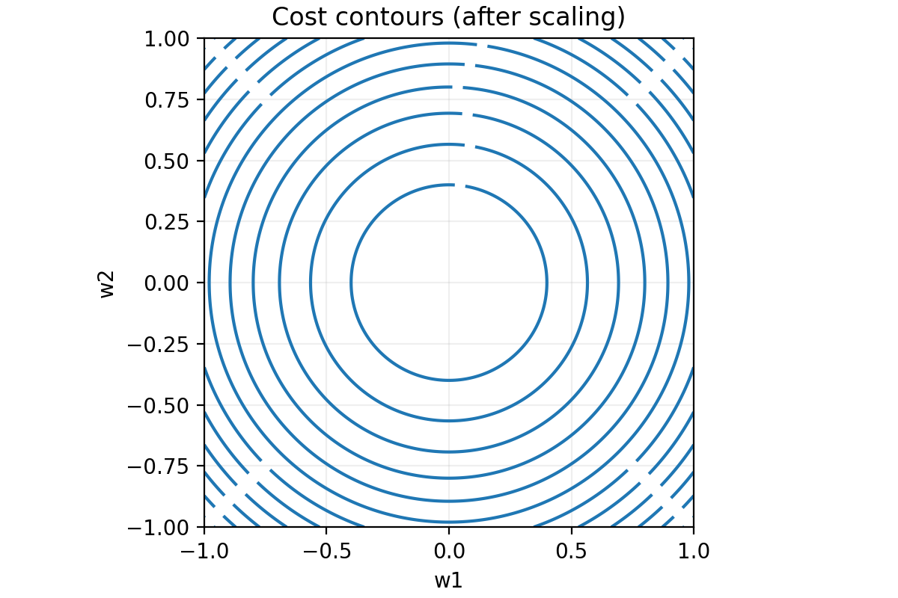 |

### Impact on **Gradient Descent**

- Without scaling, updates can **zig‑zag** and take many iterations.
- With scaling, updates take **more direct paths**, reducing runtime substantially.

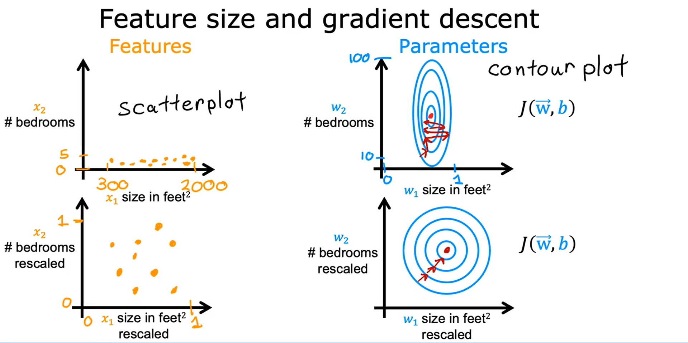

### Key Takeaways

- Features with very different scales → gradient descent is inefficient.
- **Feature scaling** standardizes ranges (e.g., [0,1]) → faster convergence.
- General rule:
  - Large feature range → small weight.
  - Small feature range → large weight.

---

## Lecture 6: Feature Scaling Part 2

### Overview

- Implement three practical scaling methods and visualize their effects:
  - **Divide by max** (0–1 scaling)
  - **Mean normalization** (center around 0, scale by range)
  - **Z-score normalization** (center and scale by standard deviation)

Run this to generate the figures used below:

```bash
python scripts/generate_feature_scaling_part2.py
```

### **Why Scaling?**

- Features may have **different scales** (e.g., income in thousands vs. age in years).
- **Without scaling**, models may give **higher importance** to **larger‑scaled features**.
- **Scaling** improves **convergence speed** in **Gradient Descent** and ensures **fair feature contribution**.

### **Methods of Feature Scaling**

#### 1. **Divide by max**

Formula:

```
x' = x / max(x)
```

- Scales all values between 0 and 1.
- Useful when the distribution is not Gaussian and you want bounded values.

- If $x_1 \in [300, 2000]$, use $x_{1,\text{scaled}} = x_1 / 2000$ → $0.15 \le x_{1,\text{scaled}} \le 1$.
- If $x_2 \in [0, 5]$, use $x_{2,\text{scaled}} = x_2 / 5$ → $0 \le x_{2,\text{scaled}} \le 1$.

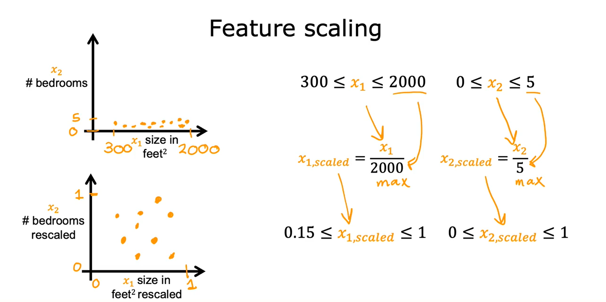

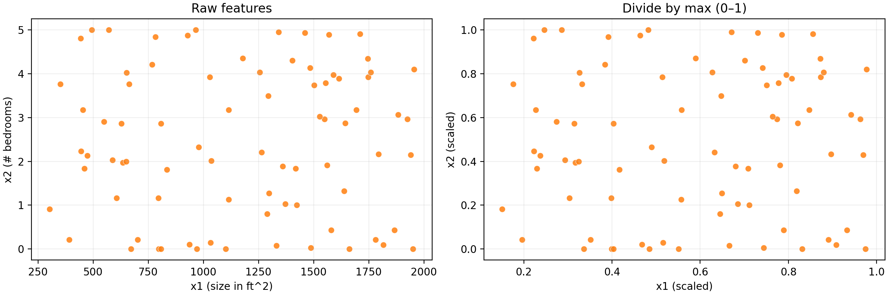

#### 2. **Mean normalization**

Formula:

```
x' = (x - μ) / (max - min)
```

where **μ** = mean of the feature.

##### **Example:**

    μ₁ = 600, range = 2000–300 → x₁' ∈ [-0.18, 0.82]
    μ₂ = 2.3, range = 5–0 → x₂' ∈ [-0.46, 0.54]

- Compute means $\mu_1, \mu_2$ on the training set.
- Transform $x_{1,\text{mn}} = (x_1 - \mu_1) / (\max(x_1)-\min(x_1))$.
- Transform $x_{2,\text{mn}} = (x_2 - \mu_2) / (\max(x_2)-\min(x_2))$.
- Centers features near 0 with values often in about $[-1, 1]$.

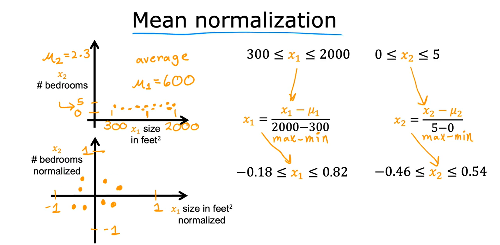

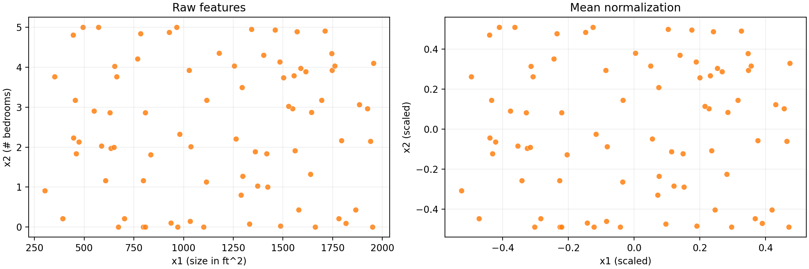

#### 3. **Z-score Normalization (Standardization)**

Formula:

```
x' = (x - μ) / σ
```

where **σ** = standard deviation.

#### **Example:**

    μ₁ = 600, σ₁ = 450 → x₁' ∈ [-0.67, 3.1]
    μ₂ = 2.3, σ₂ = 1.4 → x₂' ∈ [-1.6, 1.9]

- Compute means $\mu_j$ and standard deviations $\sigma_j$.
- Transform $x_{j,\text{z}} = (x_j - \mu_j) / \sigma_j$.
- Typical values lie within a few standard deviations of 0.

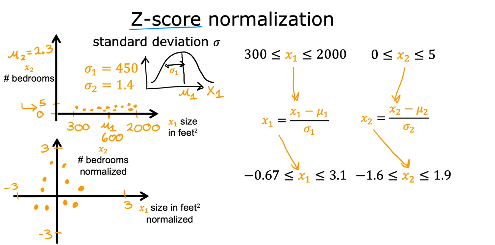

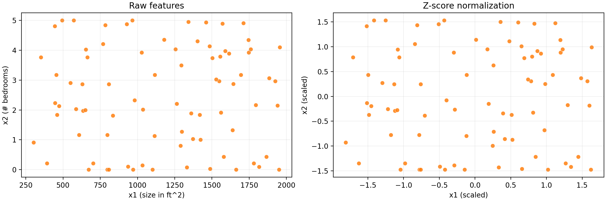

##### What is **standard deviation (σ)**?

- **Standard Deviation (σ)** is a measure of how **spread out** the data is.
- It tells us how far the values are, on average, from the **mean (μ)**.

  $\Large\text{σ} = \sqrt{\dfrac{\sum\limits_{}^{}{{\lvert x-\mu\rvert^2}}}{N}}$

**In simple words:**

- If **σ is small**, most values are **close to the mean**.
- If **σ is large**, the values are **spread out** over a wider range.

**Example:**

```
Suppose you have house sizes: [1000, 1100, 1200, 1300, 1400]
Mean (μ) = 1200
σ = 141 (small → values are close to mean)
Another set: [500, 1500, 2500, 3500, 4500]
Mean (μ) = 2500
σ = 1414 (large → values spread out widely)
```

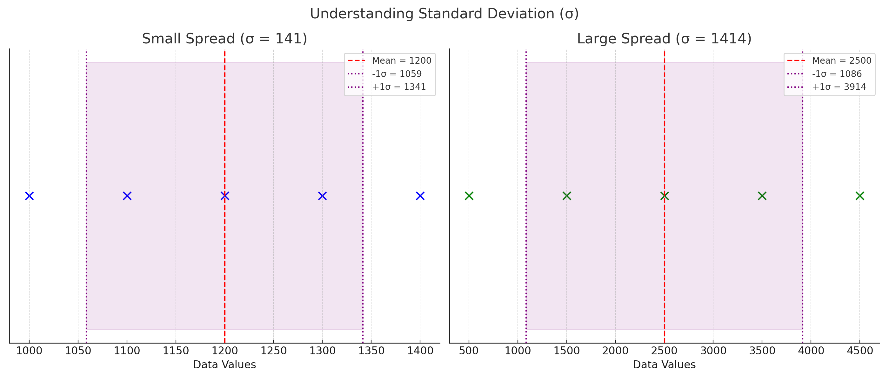

### **What ranges are acceptable?**

- Aim for each feature $x_j$ to land roughly in $[-1, 1]$; $[-3, 3]$ or $[-0.3, 0.3]$ are also fine.
- If a feature already lies in a compact range (e.g., $[0, 3]$ or $[-2, 0.5]$), scaling is optional.

### **When to Rescale?**

- Rescale if a feature has a **very large** span (e.g., $[-100, 100]$) or is **extremely small** (e.g., $[-0.001, 0.001]$).
- Rescale domain-specific features like temperature (e.g., 98.6–105°F) to avoid slowing gradient descent.
- Rule of thumb: aim for values around **[-1, 1]**.
- In practice, there’s almost never harm in scaling; it often **speeds up convergence** significantly.

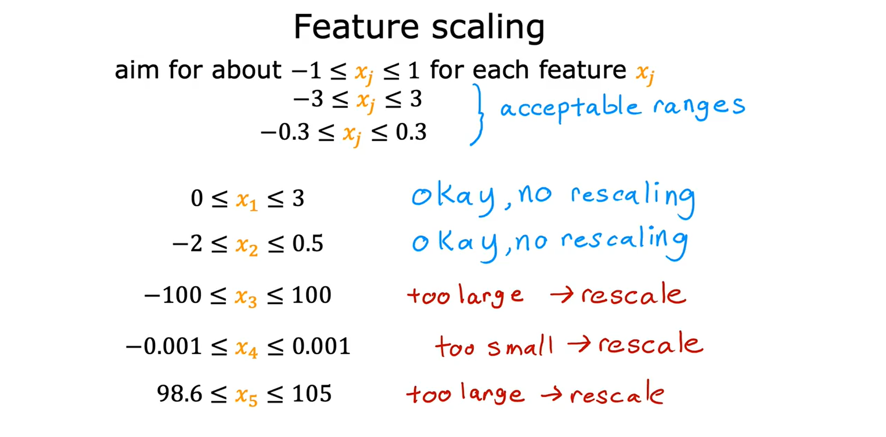

### **Visual Intuition**

- **Before scaling**: data points are
  stretched along one axis.
- **After scaling**: points become compact
  and centered → gradient descent works faster.

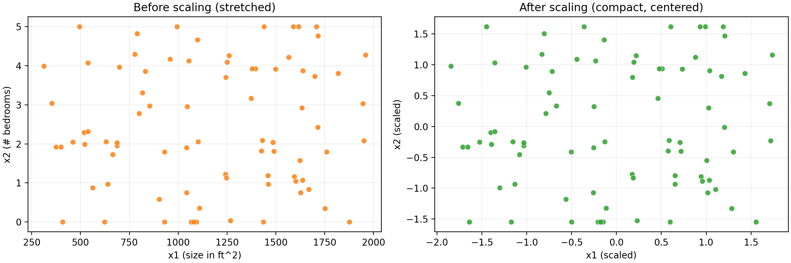

### **Key Takeaways**

- Feature scaling makes training **faster and more stable**.
- Methods include:
  - Rescaling (divide by max)
  - Mean normalization
  - Z-score normalization
- Always aim for **similar feature ranges**, ideally around **[-1, 1]**.
- **When in doubt → Rescale!**

---

## Lecture 7: Checking **Gradient Descent** for **Convergence**

### **Overview**

- When running **gradient descent**, it’s important to know if the algorithm is actually **converging** — that is, if it’s finding parameters close to the **global minimum** of the **cost function** **$ J(\vec{w}, b)$**.
- Goal: make sure **gradient descent** is actually reducing the **$cost J(\vec{w}, b)$** and approaching the **global minimum**.
- Tool: plot a **learning curve** — cost vs. iterations.

### **Why Check Convergence?**

- **Gradient descent** updates parameters `w` and `b` to minimize the **cost function** **$ J(\vec{w}, b)$**.
- If gradient descent is working properly:
  - The **cost J should decrease after every iteration**.
  - If J **increases** → either:
    - The **learning rate α (alpha)** is **too large**, or
    - There’s a **bug in the code**.

### **Learning Curve**

- A **learning curve** plots:

  - **x‑axis** → number of **iterations**
  - **y‑axis** → **cost** value **$ J(\vec{w}, b)$**

- Plot J on the training set after each iteration (each simultaneous update of w and b).

This helps visualize if gradient descent is progressing.

✅ Example behavior:

- At **100 iterations**, you have certain `w, b` values → compute J → plot that point.
- At **200 iterations**, new values of `w, b` → new J → next point.
- Continue plotting to see the **trend**.

Generate the **demo curve**:

```bash
python scripts/generate_learning_curve.py
```

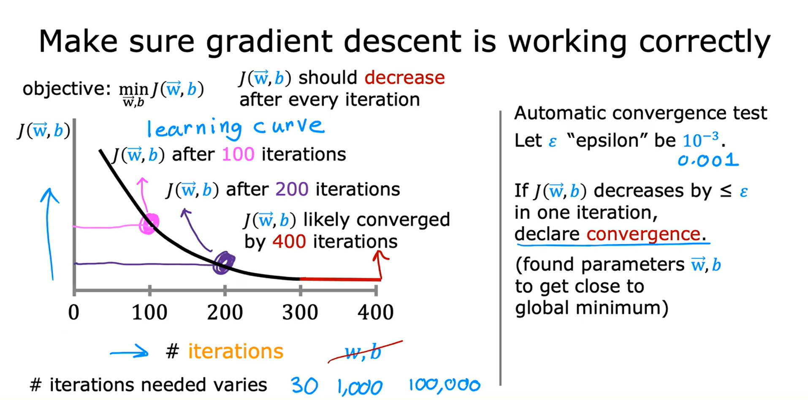

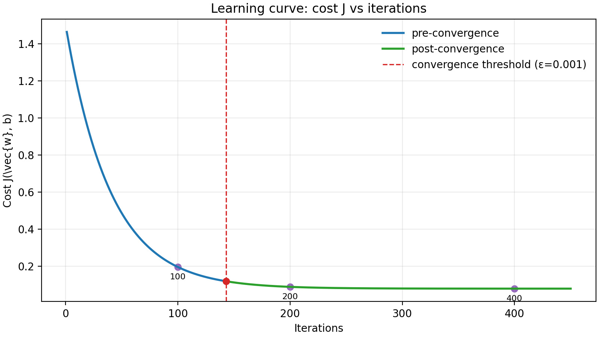

- Early iterations → steep drop in cost J.
- Later iterations → curve flattens, showing convergence.

### **What to Expect When It’s Working**

- J should **decrease every iteration** (monotonic downwards). If it **increases**, either **α is too large** or there’s a **bug**.
- When the curve **levels off** (e.g., by 300–400 iterations in the example), gradient descent has **converged**.

### **Automatic Convergence Test (ε)**

- Choose a small threshold **ε (epsilon)** (e.g., **0.001 = 10⁻³**).
- If the drop in **J** between two iterations is **≤ ε**, declare **convergence**.
- Formula:
  ```math
  | J(t) - J(t+1) | < ε  →  Convergence
  ```
- In practice, picking ε is tricky — visually checking the curve is often more reliable.

### **How Many Iterations?**

- It varies widely: could be **30**, **1,000**, or **100,000+** depending on the problem and scaling.
- That’s why plotting the **learning curve** is useful to decide **when to stop training**.

### **Key Takeaways**

- Always **plot cost J vs. iterations** to check **convergence**.
- **J should decrease monotonically** (downwards only).
- If **J increases** → **α (learning rate)** may be **too high**, or there’s a **bug**.
- Gradient descent **converges** when **J levels off** (flattens).
- Automatic tests with **ε** exist, but **graphs are usually clearer**.
