## Regression with Multiple Input Variables

### Table of Contents

- [Lecture 1: Multiple Features](#lecture-1-multiple-features)

  - [Introduction](#introduction)
  - [Notation](#notation)
  - [Training sets](#training-sets)
  - [Multiple Linear Regression Model](#multiple-linear-regression-model)
    - [Previous (single feature)](#previous-single-feature)
    - [Now (with multiple features – 4 features shown)](#now-with-multiple-features--4-features-shown)
    - [General (n features)](#general-n-features)
  - [Example and interpretation](#example-and-interpretation)
  - [Dot product refresher](#dot-product-refresher)
  - [Vector Notation](#vector-notation)
    - [Parameters](#parameters)
    - [Features](#features)
    - [Model in Vector Form](#model-in-vector-form)
    - [Dot Product Expansion](#dot-product-expansion)
  - [Key Points](#key-points)
  - [Terminology](#terminology)

- [Lecture 2: Vectorization Part 1](#lecture-2-vectorization-part-1)

  - [Overview](#overview)
  - [Example setup](#example-setup)
  - [Without vectorization](#without-vectorization)
  - [With vectorization](#with-vectorization)
  - [Why vectorization is faster](#why-vectorization-is-faster)
  - [Key takeaways](#key-takeaways)

- [Lecture 3: Vectorization — Part 2](#lecture-3-vectorization--part-2)

  - [Introduction](#introduction-1)
  - [Without vectorization (sequential)](#without-vectorization-sequential)
  - [Vectorized execution (parallel)](#vectorized-execution-parallel)
  - [Visual Explanation](#visual-explanation)
  - [Vectorization in multiple linear regression](#vectorization-in-multiple-linear-regression)
  - [Why Vectorization Matters](#why-vectorization-matters)
  - [Practice with NumPy](#practice-with-numpy)
  - [Key takeaways — L3](#key-takeaways--l3)
  - [Visualization: timeline](#visualization-timeline)

- [Lecture 4: Gradient Descent for Multiple Linear Regression](#lecture-4-gradient-descent-for-multiple-linear-regression)
  - [Overview](#overview-1)
  - [Multiple Linear Regression in Vector Form](#multiple-linear-regression-in-vector-form)
  - [Vector notation refresher](#vector-notation-refresher)
  - [Model and cost (vector form)](#model-and-cost-vector-form)
  - [Gradient descent updates](#gradient-descent-updates)
  - [What’s different vs one feature](#whats-different-vs-one-feature)
  - [From One Feature → Multiple Features](#from-one-feature--multiple-features)
  - [Alternative: Normal equation](#alternative-normal-equation)
  - [Practice pointers](#practice-pointers)

<!-- When you add Lecture 2, Lecture 3, ... follow the same pattern:

## Lecture N: Title
- Add a corresponding section heading below in the document
- Then add links here in the TOC like:
- [Lecture N: Title](#lecture-n-title)
  - [Introduction](#introduction-n)
  - [Notation](#notation-n)
  - ... etc.

You can create unique anchors by appending -n to subsection ids (e.g., #introduction-2) to avoid collisions across lectures. -->

### Lecture 1: Multiple Features

### Introduction

- Linear regression can be extended to handle **multiple features** (not just one).
- Instead of using only one feature (e.g., house size), we can use more:
  - Number of bedrooms
  - Number of floors
  - Age of the home

This provides more information for predicting the **target** (e.g., house price).

- **Big idea**: Extend linear regression from a single feature (univariate) to many features (multiple linear regression) to make predictions more accurate and models more expressive.

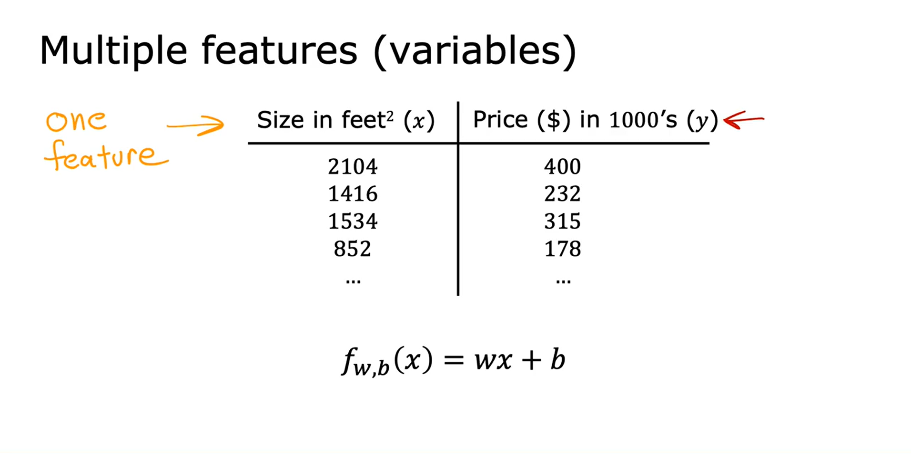

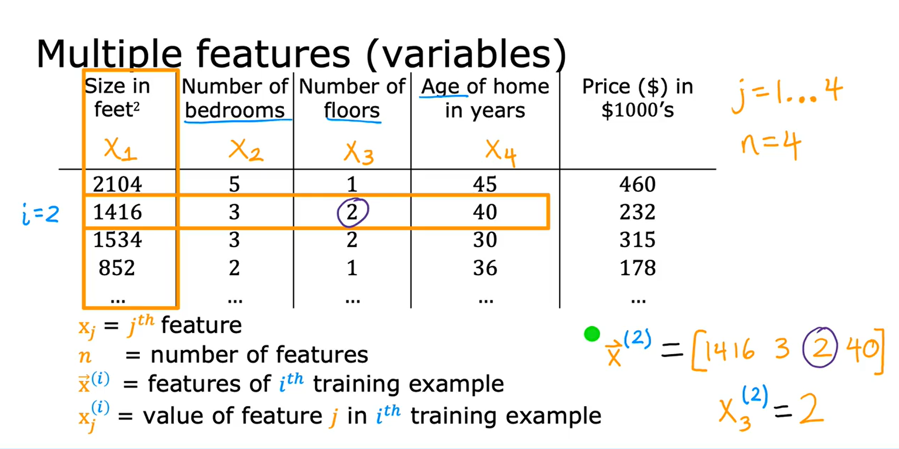

### Notation

| Size in ft² x<sub>1</sub> | Bedrooms x<sub>2</sub> | Floors x<sub>3</sub> | Age (years) x<sub>4</sub> | Price ($) in 1000's (y) |
| ------------------------- | ---------------------- | -------------------- | ------------------------- | ----------------------- |
| 2104                      | 5                      | 1                    | 45                        | 460                     |
| 1416                      | 3                      | 2                    | 40                        | 232                     |
| 1534                      | 3                      | 2                    | 30                        | 315                     |
| 852                       | 2                      | 1                    | 36                        | 178                     |

```math
\begin{aligned}
\text{Features: } & x_1, x_2, \dots, x_n,\quad n \text{ is the number of features} \\
\text{Training example: } & \vec{x}^{(i)} = [x^{(i)}_1, x^{(i)}_2, \dots, x^{(i)}_n] \\
\text{Single feature value: } & x^{(i)}_j \\
\text{Parameter vector: } & \vec{w} = [w_1, w_2, \dots, w_n],\quad b \in \mathbb{R}
\end{aligned}
```

Example (housing):

- $\vec{x}^{(2)} = [1416, 3, 2, 40]$ means size=1416, bedrooms=3, floors=2, age=40.
- $x^{(2)}_3 = 2$ (the third feature—number of floors—of example 2).

### Training sets

Univariate training set (single feature):

| Size in ft² (\(x\)) | Price ($) in 1000's (\(y\)) |
| ------------------- | --------------------------- |
| 2104                | 400                         |
| 1416                | 232                         |
| 1534                | 315                         |
| 852                 | 178                         |

Multiple features training set:

| Size in ft² \(x_1\) | Bedrooms \(x_2\) | Floors \(x_3\) | Age (years) \(x_4\) | Price ($) in 1000's (\(y\)) |
| ------------------- | ---------------- | -------------- | ------------------- | --------------------------- |
| 2104                | 5                | 1              | 45                  | 460                         |
| 1416                | 3                | 2              | 40                  | 232                         |
| 1534                | 3                | 2              | 30                  | 315                         |
| 852                 | 2                | 1              | 36                  | 178                         |

### Multiple Linear Regression Model

- **Expanded form**:

```math
f_{\vec{w},b}(\vec{x}) = w_1 x_1 + w_2 x_2 + \cdots + w_n x_n + b
```

- **Compact (vector) form**:

```math
f_{\vec{w},b}(\vec{x}) = \vec{w} \cdot \vec{x} + b
```

where $\vec{w} \cdot \vec{x}$ is the **dot product**.

#### Previous (single feature)

```math
f_{w,b}(x) = wx + b \quad \text{(univariate)}
```

#### Now (with multiple features – 4 features shown)

```math
f_{w,b}(x) = w_1 x_1 + w_2 x_2 + w_3 x_3 + w_4 x_4 + b
```

#### General (n features)

```math
f_{\vec{w},b}(\vec{x}) = \sum_{j=1}^{n} w_j x_j + b \quad \text{(multiple features)}
```

```math
\vec{w} = [w_1, w_2, \dots, w_n], \quad \vec{x} = [x_1, x_2, \dots, x_n]
```

```math
f_{\vec{w},b}(\vec{x}) = \vec{w} \cdot \vec{x} + b, \quad \text{where} \quad \vec{w} \cdot \vec{x} = \sum_{j=1}^{n} w_j x_j
```

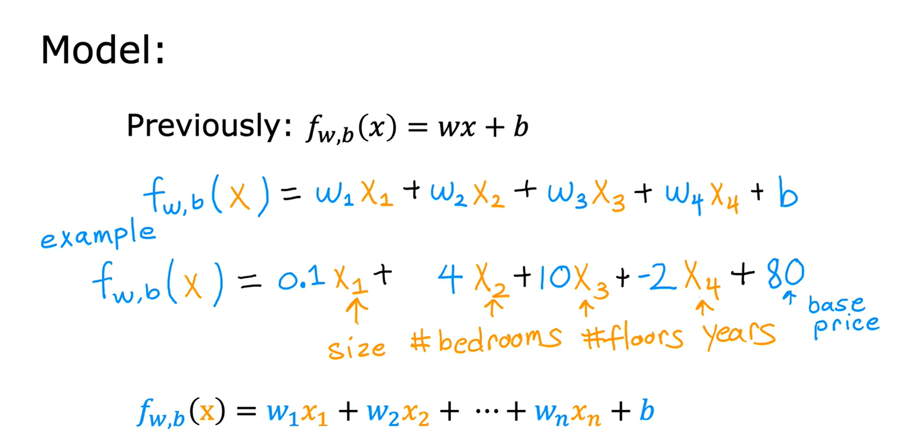

### Example and interpretation

```math
f_{\vec{w},b}(\vec{x}) = 0.1\,x_1 + 4\,x_2 + 10\,x_3 - 2\,x_4 + 80
```

Interpretation:

- \( b = 80 \): Base price = $80,000.
- \( 0.1x_1 \): Each sq. ft. adds $100.
- \( 4x_2 \): Each bedroom adds $4,000.
- \( 10x_3 \): Each floor adds $10,000.
- \( -2x_4 \): Each year of age decreases value by $2,000.

### Dot product refresher

- For vectors \(\vec{w}\) and \(\vec{x}\):

```math
\begin{aligned}
\vec{w} \cdot \vec{x} &= \sum_{j=1}^{n} w_j x_j = w_1 x_1 + w_2 x_2 + \cdots + w_n x_n \\
f_{\vec{w},b}(\vec{x}) &= \vec{w} \cdot \vec{x} + b
\end{aligned}
```

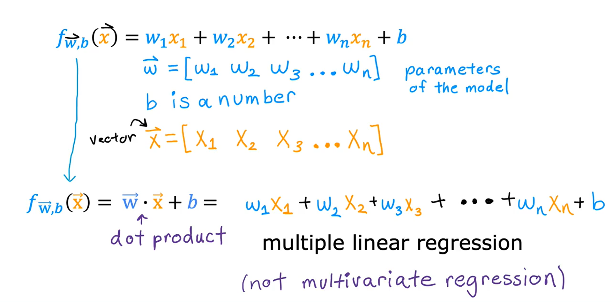

### Vector Notation

#### Parameters

```math
\vec{w} = [w_1, w_2, \dots, w_n] \text{→
weight vector (model parameters).}\newline
b = \text{bias (a single number).} b \in \mathbb{R}
```

#### Features

```math
\vec{x} = [x_1, x_2, \dots, x_n] →
\text{feature vector (input data).}
```

#### Model in Vector Form

```math
f_{\vec{w},b}(\vec{x}) = \vec{w} \cdot \vec{x} + b
```

#### Dot Product Expansion

```math
\vec{w} \cdot \vec{x} = w_1 x_1 + w_2 x_2 + w_3 x_3 + \dots + w_n x_n
```

### Key Points

- Multiple linear regression uses many input features to predict a single output.
- This model is called **Multiple Linear Regression**.
- Note: "Multivariate regression" means predicting **multiple outputs**, which is **not the same thing**.
- Using **vectorization** makes implementation simpler and faster.

### Terminology

- **Multiple linear regression**: linear regression with multiple input features.
- **Univariate regression**: linear regression with a single feature.
- Note: The term “multivariate regression” refers to something else (predicting multiple outputs) and is not used here.

## Lecture 2: Vectorization Part 1

### Overview

- Vectorization makes ML code both shorter and much faster by using optimized linear algebra routines (like NumPy) and parallel hardware (CPU SIMD, GPU).
- Goal: replace explicit per-element operations/loops with math operations on whole vectors/matrices.

### Example setup

```math
\vec{w} = [w_1, w_2, w_3], \quad b \in \mathbb{R}, \quad \vec{x} = [x_1, x_2, x_3], \quad n=3
```

- In math, indices often start at 1: \(w_1, w_2, w_3\); in Python/NumPy arrays start at 0: `w[0]`, `w[1]`, `w[2]`.

### Without vectorization

Mathematical form using a summation:

```math
f_{\vec{w},b}(\vec{x}) =  w_1 x_1 + w_2 x_2 +w_3 x_3 + b
```

```math
f_{\vec{w},b}(\vec{x}) = \sum_{j=1}^{n} w_j x_j + b
```

#### Python (manual multiplication)

```
f = w[0]*x[0] + w[1]*x[1] + w[2]*x[2] + b
```

#### Python (using loop)

Naive code (explicit loop; Python ranges are 0..n-1):

```python
f = 0.0
for j in range(0, n):
    f = f + w[j] * x[j]
f = f + b
```

This works but scales poorly when n is large (e.g., 100k).

### With vectorization

Use the dot product for the same computation in one line:

```math
f_{\vec{w},b}(\vec{x}) = \vec{w} \cdot \vec{x} + b
```

```python
f = np.dot(w, x) + b
```

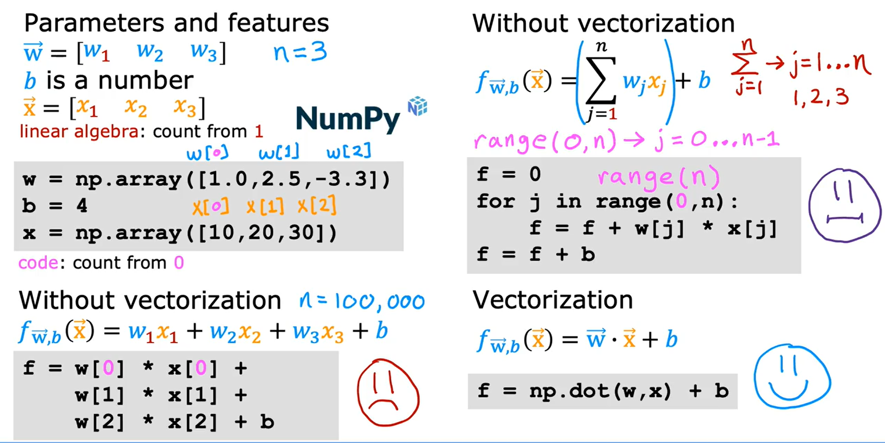

### Why vectorization is faster

NumPy’s dot function is implemented in optimized linear algebra libraries.
These libraries can:

- Use parallel hardware (multi-core CPUs or GPUs).
- Perform computations much faster than Python loops.

This becomes especially important when working with large datasets and high-dimensional features.

### Key takeaways

- Vectorization = shorter code + faster execution.
- Avoid writing manual loops for mathematical operations when possible.
- Use libraries like NumPy to take advantage of optimized, parallelized operations.
- Practice writing `np.dot(w, x) + b` instead of manual summations.

---

## Lecture 3: Vectorization — Part 2

### Introduction

When I first learned about **vectorization**, it felt like a magic trick. The same algorithm, when vectorized, ran **much faster** than the unvectorized version.

- Without vectorization → operations happen **step by step (sequential)**.
- With vectorization → operations happen **in parallel**, using **optimized hardware**.

This difference is a **game‑changer** in machine learning, especially for **large datasets** and **complex models**.

### Without vectorization (sequential)

A simple **for loop** runs each calculation **one at a time**.

- A for-loop like

```python
f = 0
for j in range(0, 16):
    f += w[j] * x[j]
```

- At t<sub>0</sub>, compute f + w[0] × x[0].
- At t<sub>1</sub>, compute f + w[1] × x[1].
- ...
- At t<sub>15</sub>, compute f + w[15] × x[15]. Performs one multiply‑add per step at times (t<sub>0</sub>, t<sub>1</sub>, ... , t<sub>15</sub>). This is sequential: one after another.

This means 16 separate steps are needed.
Inefficient for large 𝑛 (e.g., thousands of features).

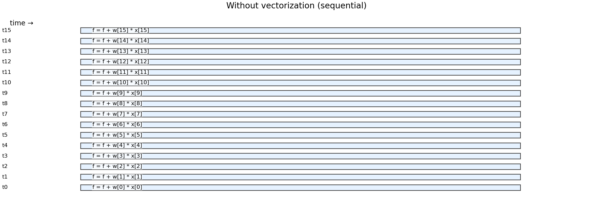

### Vectorized execution (parallel)

Vectorization uses **specialized hardware** to perform many operations **simultaneously**.

```python
import numpy as np
f = np.dot(w, x)  # vectorized dot product
```

- Multiplications w[j]×x[j] for all 𝑗 happen in **parallel**.
- Then, hardware efficiently **sums them up in one step**.

- Using **np.dot(·,·)**, hardware multiplies all pairs (w<sub>j</sub>, x<sub>j</sub>) at once, then **reduces** (adds) them efficiently.

```math
f_{\vec{w},b}(\vec{x}) = \vec{w} \cdot \vec{x} + b
```

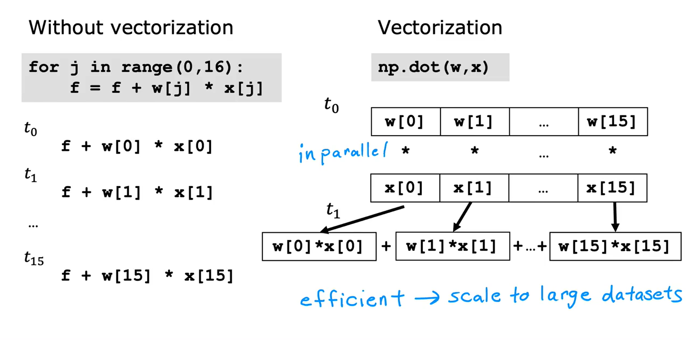

### Visual Explanation

#### Without Vectorization

- Computations happen **one after another**.
- Each loop step **updates the result**.

#### With Vectorization

- All multiplications are done **in parallel**.
- Results are added together **efficiently**.

### Vectorization in multiple linear regression

Suppose we are updating 16 parameters

```math
\vec{w}  = (w_1, w_2, \dots, w_{16})
```

with derivative vector

```math
\vec{d}  = (d_1, d_2, \dots, d_{16})
```

,
and learning rate **α = 0.1**.

#### Without vectorization (loop)

```python
for j in range(0, 16):
    w[j] = w[j] - 0.1 * d[j]
```

- Updates each parameter **one at a time**.

#### With vectorization (all at once)

```python
w = w - 0.1 * d
```

- Updates **all parameters in parallel**.
- Behind the scenes, **NumPy** uses optimized hardware to do this **in one step**.

This speed‑up becomes crucial with **thousands of features** and **large datasets**.
It can mean the difference between:

- Training in **minutes** vs training in **hours**

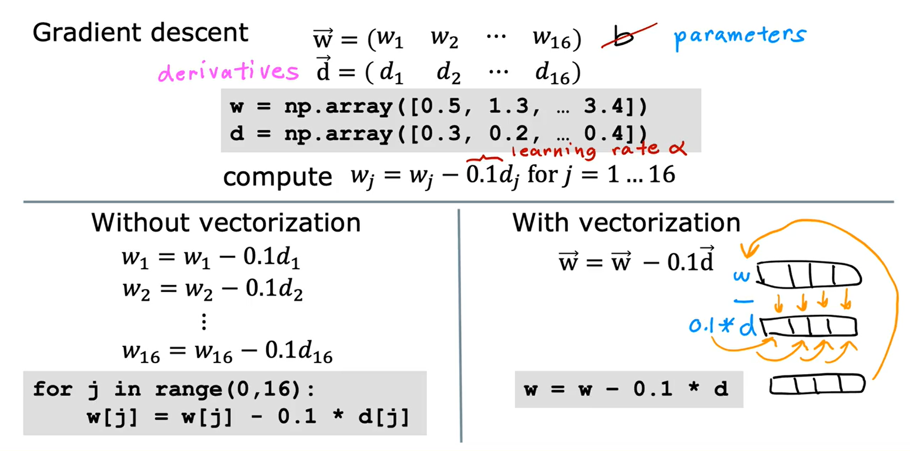

### Why Vectorization Matters

- **Efficiency** → Vectorized code allows computations to **scale seamlessly** to very large datasets.
- **Parallelism** → Leverages the power of **multi-core CPUs** and **GPUs** for simultaneous operations.
- **Cleaner Code** → Eliminates unnecessary loops, making code **shorter, simpler, and easier to read**.
- **Performance Boost** → Runs **10x to 100x faster** than traditional loop-based implementations.

### Practice with NumPy

- Create vectors as **NumPy arrays**, use `np.dot` for dot products, time vectorized vs looped code to observe speedups.

### Key takeaways — L3

- Vectorization turns many scalar ops into a few high-level array ops.
- Same math, but far fewer Python steps and better hardware utilization.
- The benefit grows with dimensionality (n) and dataset size.

### Visualization: timeline

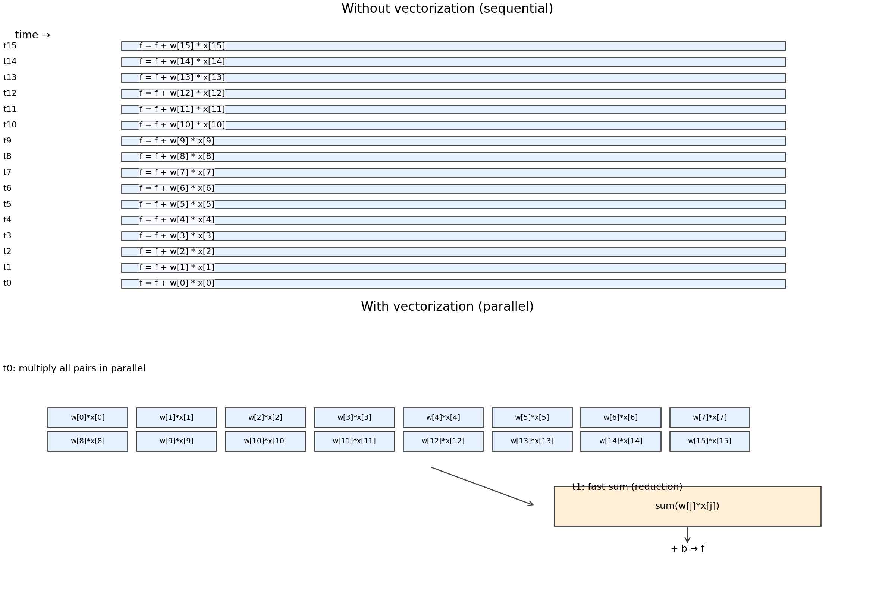

---

## Lecture 4: Gradient Descent for Multiple Linear Regression

### Overview

Now that we’ve learned about **gradient descent**, **multiple linear regression**, and **vectorization**, let’s put them all together.  
This gives us an efficient way to train a **multiple linear regression model**.

- We combine: **multiple linear regression** + **vectorization** + **gradient descent**.
- Treat parameters as a vector $\vec{w}$ and bias as a scalar $b$ to write concise math and fast code.

### Multiple Linear Regression in Vector Form

Instead of treating each parameter $w_1, w_2, \dots, w_n$ separately, we **collect them into a single vector**:

- **$\vec{w}$** = vector of parameters (length \(n\)).
- **$b$** = bias term (a single number).
- The prediction function can be written as:

```math
f_{\vec{w},b}(\vec{x}) = \vec{w} \cdot \vec{x} + b
```

```math
\vec{w} = [w_1, \dots, w_n], \quad b \in \mathbb{R}, \quad \vec{x} = [x_1, \dots, x_n]
```

- The **cost function** is written as:

```math
J(\vec{w}, b) = \frac{1}{2m} \sum_{i=1}^{m} \Big( f_{\vec{w},b}(\vec{x}^{(i)}) - y^{(i)} \Big)^2
```

So instead of writing cost as a function of many separate $w_j$’s, we write it more compactly with the **parameter vector** $\vec{w}$ and the scalar $b$.

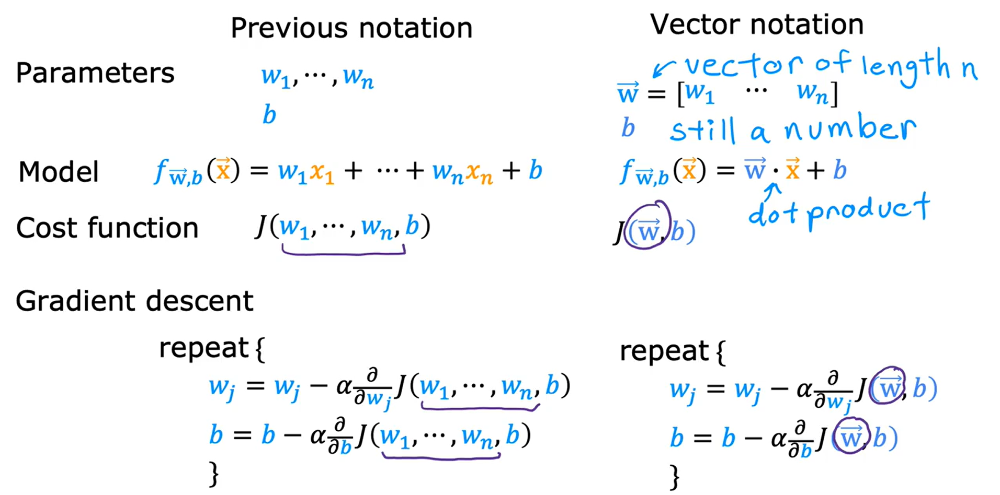

### Vector notation refresher

```math
\vec{w} = [w_1, \dots, w_n], \quad b \in \mathbb{R}, \quad \vec{x} = [x_1, \dots, x_n]
```

### Model and cost (vector form)

```math
f_{\vec{w},b}(\vec{x}) = \vec{w} \cdot \vec{x} + b
```

Cost (using m training examples):

```math
J(\vec{w}, b) = \frac{1}{2m} \sum_{i=1}^{m} \Big( f_{\vec{w},b}(\vec{x}^{(i)}) - y^{(i)} \Big)^2
```

### Gradient descent updates

Repeat until **convergence**:

```math
w_j \leftarrow w_j - \alpha \, \frac{\partial}{\partial w_j} J(\vec{w}, b) \quad (j = 1, \dots, n)
```

```math
b \leftarrow b - \alpha \, \frac{\partial}{\partial b} J(\vec{w}, b)
```

Where the partial derivatives are:

```math
\frac{\partial}{\partial w_j} J(\vec{w}, b) = \frac{1}{m} \sum_{i=1}^{m} \Big( f_{\vec{w},b}(\vec{x}^{(i)}) - y^{(i)} \Big) x^{(i)}_j
```

```math
\frac{\partial}{\partial b} J(\vec{w}, b) = \frac{1}{m} \sum_{i=1}^{m} \Big( f_{\vec{w},b}(\vec{x}^{(i)}) - y^{(i)} \Big)
```

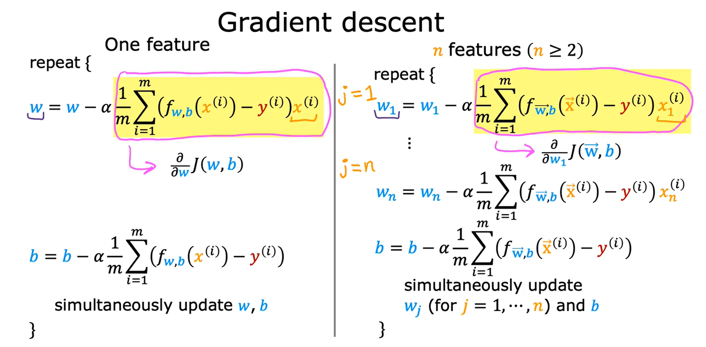

### What’s different vs one feature

- The error term is still \( f(\vec{x}) - y \).
- Each step updates all \(w_j\) (for j = 1…n) using their corresponding feature \(x^{(i)}\_j\).
- Vectorization lets you compute all partial derivatives and updates **in parallel**.

### From One Feature → Multiple Features

- With **one feature**, we only had one update rule for \( w \) and one for \( b \).
- With **multiple features**, we now have \( n \) parameters:
  - Update \( w_1, w_2, ..., w_n \).
  - Update \( b \) as before.

The error term is still:

```math
(f_{\vec{w}, b}(\vec{x}) - y)
```

but now it multiplies with **each input feature** \( x_j \) when updating \( w_j \).

### Alternative: Normal equation

- Solves for \(\vec{w}, b\) in one shot (no iterations), but:
  - Only applies to **linear regression**; doesn’t generalize to other models (e.g., logistic regression, neural nets).
  - Can be **slow** when number of features is very large.
  - Often hidden behind the scenes in some ML libraries’ linear regression implementations.

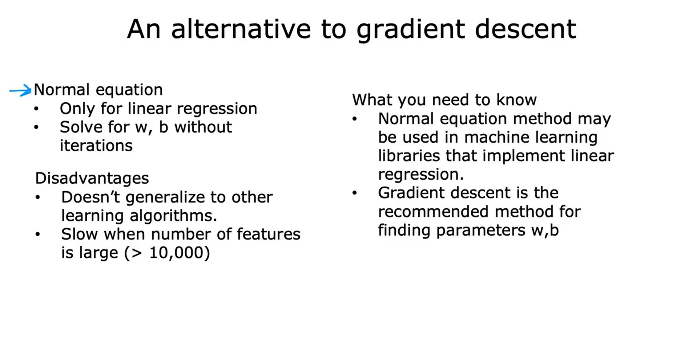

### Practice pointers

- Use **NumPy** for vectorized predictions, cost, and gradients.
- If NumPy syntax feels new, revisit the earlier vectorization lab for a refresher.
- Choose **learning rate (α)** and apply feature scaling to make gradient descent converge faster.
