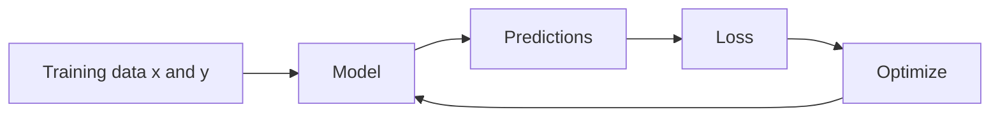
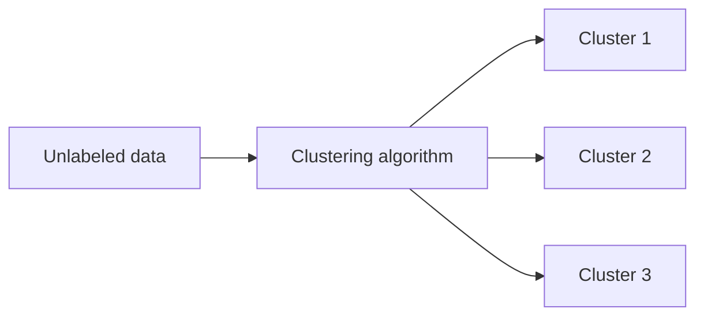
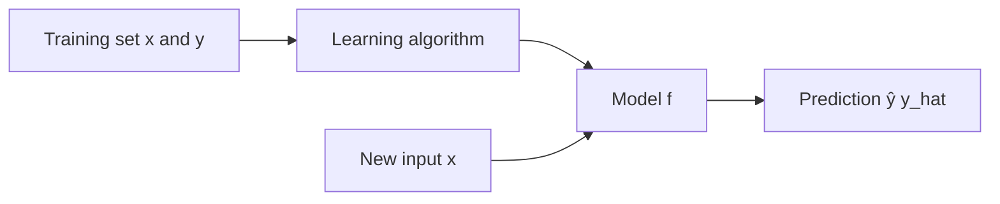
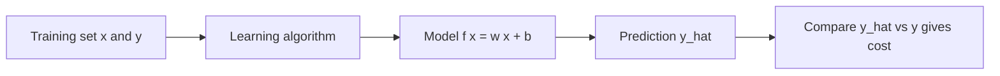

### Table of Contents
- [Module 1 — Introduction to Machine Learning](#module-1--introduction-to-machine-learning)
  - [Lecture 1: Welcome to Machine Learning](#lecture-1-welcome-to-machine-learning)
    - [Quick summary (L1)](#quick-summary-l1)
    - [What is ML (in simple words)](#what-is-ml-in-simple-words)
    - [Everyday examples](#everyday-examples)
    - [Industry examples](#industry-examples)
    - [Why now](#why-now)
    - [Key terms (L1)](#key-terms-l1)
    - [Remember (L1)](#remember-l1)
    - [Next steps (L1)](#next-steps-l1)
  - [Lecture 2: Applications of Machine Learning](#lecture-2-applications-of-machine-learning)
    - [Quick summary (L2)](#quick-summary-l2)
    - [Why ML is used today](#why-ml-is-used-today)
    - [Where ML is used](#where-ml-is-used)
    - [AGI in one line](#agi-in-one-line)
    - [Impact and value](#impact-and-value)
    - [Opportunities beyond software](#opportunities-beyond-software)
    - [Why learn ML now](#why-learn-ml-now)
    - [Next steps (Course)](#next-steps-course)
  - [Lecture 3: What is Machine Learning](#lecture-3-what-is-machine-learning)
    - [Quick summary (L3)](#quick-summary-l3)
    - [Simple definition (Samuel)](#simple-definition-samuel)
    - [Checkers example (self-play)](#checkers-example-self-play)
    - [More data usually helps (L3)](#more-data-usually-helps-l3)
    - [Types of ML (overview)](#types-of-ml-overview)
    - [Tools vs know-how](#tools-vs-know-how)
    - [Next steps (L3)](#next-steps-l3)
  - [Lecture 4: Supervised Learning (Part 1)](#lecture-4-supervised-learning-part-1)
    - [Quick Summary (L4)](#quick-summary)
    - [What is supervised learning?](#what-is-supervised-learning)
    - [Two types: Regression and Classification](#two-types-regression-and-classification)
    - [Common x→y examples](#common-xy-examples)
    - [Example: predict house price](#example-predict-house-price)
    - [Pick the right model complexity](#pick-the-right-model-complexity)
    - [How training works](#how-training-works)
    - [Key words (L4)](#key-words-l4)
    - [Regression vs classification (which to use?)](#regression-vs-classification-which-to-use)
    - [Regenerate the figure](#regenerate-the-figure)
  - [Lecture 5: Supervised Learning (Part 2)](#lecture-5-supervised-learning-part-2)
    - [Quick Summary (L5)](#quick-summary-1)
    - [What is classification?](#what-is-classification)
    - [Binary vs multi-class](#binary-vs-multi-class)
    - [Build intuition: 1D and 2D](#build-intuition-1d-and-2d)
    - [Idea: decision boundary](#idea-decision-boundary)
    - [Tips for beginners (L5)](#tips-for-beginners-l5)
    - [At a glance: supervised vs unsupervised](#at-a-glance-supervised-vs-unsupervised)
  - [Lecture 6: Unsupervised Learning (Part 1)](#lecture-6-unsupervised-learning-part-1)
    - [Quick Summary (L6)](#quick-summary-l6)
    - [What is unsupervised learning?](#what-is-unsupervised-learning)
    - [Clustering basics](#clustering-basics)
    - [Workflow diagram](#workflow-diagram-1)
    - [Examples: news, genetics, customers](#examples-news-genetics-customers)
    - [Beginner tips (L6)](#beginner-tips-l6)
  - [Lecture 7: Unsupervised Learning (Part 2)](#lecture-7-unsupervised-learning-part-2)
    - [Quick Summary (L7)](#quick-summary-l7)
    - [Formal definition](#formal-definition)
    - [Types of Unsupervised Learning](#types-of-unsupervised-learning)
    - [Is this UL or SL? Examples](#is-this-ul-or-sl-examples)
  - [Lecture 8: Linear Regression Model (Part 1)](#lecture-8-linear-regression-model-part-1)
    - [Quick Summary (L8)](#quick-summary-l8)
    - [What is a linear regression model?](#what-is-a-linear-regression-model)
    - [Regression vs classification (recap)](#regression-vs-classification-recap)
    - [Why is it Supervised Learning?](#why-is-it-supervised-learning)
    - [Notation (Standard ML Terminology)](#notation-standard-ml-terminology)
    - [Plot and table view](#plot-and-table-view)
    - [Text data table (sample rows)](#text-data-table-sample-rows)
    - [How to read the table (text-only examples)](#how-to-read-the-table-text-only-examples)
    - [Train then predict (client's house)](#train-then-predict-clients-house)
    - [Generated example (1250 sq ft prediction)](#generated-example-1250-sq-ft-prediction)
    - [Intuition: best-fitting line](#intuition-best-fitting-line)
    - [Generated figure](#generated-figure-1)
    - [Beginner tips (L8)](#beginner-tips-l8)
  - [Lecture 9: Linear Regression Model (Part 2)](#lecture-9-linear-regression-model-part-2)
    - [Quick Summary (L9)](#quick-summary-l9)
    - [Training Set: Inputs and Outputs](#training-set-inputs-and-outputs)
    - [From training set to model f](#from-training-set-to-model-f)
    - [Prediction vs target: y-hat vs y](#prediction-vs-target-y-hat-vs-y)
    - [Linear model form: f(x) = w x + b](#linear-model-form-fx--w-x--b)
    - [Why Use Linear Functions?](#why-use-linear-functions)
    - [Workflow diagram](#workflow-diagram-2)
    - [What’s next: cost function](#whats-next-cost-function)

## Module 1 — Introduction to Machine Learning

### Lecture 1: Welcome to Machine Learning

### Quick summary (L1)
Machine learning (ML) is the science of getting computers to learn from data without being explicitly programmed. You already encounter ML daily: ranking web search results, tagging friends in photos, getting movie recommendations, using voice assistants, and filtering spam. Beyond consumer apps, ML is transforming industry—optimizing renewable energy, assisting medical diagnosis, and automating visual inspection in factories. In this course, you will learn core ML ideas and implement them in code.

### What is ML (in simple words)
- **Practical definition**: ML enables software to improve performance on tasks by learning patterns from data, rather than following hand‑written rules.
- **Why it matters**: Modern data scale and computing power let ML solve problems too complex for explicit programming.

### Everyday examples
- **Search ranking**: Systems like Google, Bing, and Baidu learn to rank web pages so you find useful answers (e.g., “how do I make a sushi roll?”).
- **Face recognition and photo tagging**: Apps can recognize friends in images and suggest labels.
- **Recommendations**: Streaming platforms suggest movies similar to what you’ve watched (e.g., after a Star Wars movie).
- **Speech recognition and voice assistants**: Dictation and commands like “Hey Siri, play a song by Rihanna” or “OK Google, show me Indian restaurants near me.”
- **Spam detection**: Email services flag suspicious messages (e.g., “Congratulations! You’ve won a million dollars”).

### Industry examples
- **Renewable energy optimization**: Improving wind turbine power generation using predictive models and control.
- **Healthcare support**: Assisting clinicians in making more accurate diagnoses.
- **Manufacturing quality inspection**: Computer vision on assembly lines to detect defects (e.g., Landing AI deployments).

### Why now?
- **Data availability**: Abundant digital activity generates labeled and unlabeled data.
- **Compute**: Affordable, scalable hardware accelerates training and inference.
- **Algorithms**: Advances in models and training techniques drive real‑world performance.

### Key terms (L1)
- **Ranking**: Ordering items (e.g., web pages) by relevance learned from data.
- **Computer vision**: Enabling computers to understand images and video (e.g., face recognition, defect detection).
- **Recommendation systems**: Predicting what a user will like based on behavior and content.
- **Speech recognition**: Converting spoken language to text; used in voice assistants.
- **Spam filtering**: Classifying messages as spam vs. legitimate.

### Remember (L1)
- **ML is already everywhere** in consumer apps and industry.
- **Definition to remember**: Getting computers to learn without explicit programming.
- **You will build**: Practical ML implementations as part of this course.

---

### Lecture 2: Applications of Machine Learning

### Quick summary (L2)
This lecture surveys why ML has become the dominant approach for many AI problems, highlights real‑world application areas across consumer and industrial domains, provides perspective on Artificial General Intelligence (AGI), and notes the large economic impact and career opportunity driving demand for ML skills.

### Why ML is used today
- Traditional programming can solve simple, rule-based problems (like finding the shortest GPS route), but…
- Many useful tasks—web search, speech recognition, diagnosing X-rays, self-driving cars—are far too complex to describe with explicit rules.
- ML, a sub‑field of AI, enables systems to learn patterns and solutions directly from data,  rather than relying on hand-crafted instructions.

### Where ML is used
- **Consumer and platform**: Web search ranking, speech recognition, computer vision for maps/Street View, online advertising, AR, fraud detection, recommendations.
- **Industrial and enterprise**: Factory visual inspection, large‑scale agriculture, healthcare support and diagnosis, e‑commerce.
- These examples reflect work from efforts such as Google Brain, Baidu AI, Landing AI, AI Fund, and Stanford collaborations.

### AGI in one line
- **AGI (Artificial General Intelligence)** aims for human‑level general intelligence; it is widely considered far away and often overhyped.
- Timeline is uncertain (decades to centuries). A plausible path forward continues to rely on learning algorithms, potentially inspired by the brain.
- This course will revisit the AGI discussion later for broader context.

### Impact and value
- Studies (e.g., McKinsey) estimate AI/ML could generate roughly $13T in additional annual value by 2030.
- While software has seen large gains already, even greater value likely lies in non‑software sectors.

### Opportunities beyond software
- Significant untapped applications in retail, travel, transportation, automotive, and materials manufacturing.
- Demand for ML practitioners remains high due to opportunities across many industries.

### Why learn ML now
- The combination of data, compute, and mature methods makes ML broadly practical.
- Learning these skills opens doors to contribute across diverse, impactful application areas.

---

### Lecture 3: What is Machine Learning

### Quick summary (L3)
Machine learning enables computers to learn from data without being explicitly programmed. Arthur Samuel’s checkers program is a classic illustration: by playing tens of thousands of games against itself, it learned which positions lead to wins and became stronger than its creator. More learning opportunities generally yield better performance. This lecture also previews the major types of ML and emphasizes practical know‑how for applying algorithms effectively.

### Simple definition (Samuel)
- “The field of study that gives computers the ability to learn without being explicitly programmed.”
- Focuses on learning behaviors from data rather than writing exhaustive rules.

### Checkers example (self-play)
- The program improved by self‑play: the computer generated massive experience by playing itself.
- It learned to evaluate positions by correlating them with eventual wins/losses.
- Sufficient experience allowed it to surpass Samuel’s own checkers ability.

### More data usually helps (L3)
- More training data/experience typically improves model performance; dramatically less experience tends to hurt.

### Types of ML (overview)
- Two primary categories introduced: **supervised learning** and **unsupervised learning** (formal definitions next).
- In practice, supervised learning powers many real‑world systems and has advanced rapidly.
- Specialization structure: Courses 1–2 focus on supervised learning; Course 3 covers unsupervised learning, **recommender systems**, and **reinforcement learning**.

### Tools vs know-how
- It’s not enough to just know ML algorithms; knowing how to apply them correctly is essential.
- Like having advanced tools, knowing the practical recipes and best practices lets you build real, valuable ML systems.
- Common mistake: Experienced teams sometimes spend months on approaches that won’t work. Knowing best practices helps avoid wasted effort.

---

### Lecture 4: Supervised Learning (Part 1)

### Quick Summary
Supervised learning learns a mapping from inputs x to outputs y using example pairs (x, y). After training on many labeled examples, the model predicts y for new x. Two major problem types: regression (predict a number) and classification (predict a category).

### What is supervised learning?
- 99% of today's machine learning economic value comes from supervised learning.
- Supervised learning means an algorithm learns mappings from input x to output y.
- You give the algorithm examples with the “right answer” (labels y) for each input x.
- The model learns a function f that maps x → y and can generalize to unseen x.

### Two types: Regression and Classification
- **Regression**: Predict a number with many possible values.
  - Examples: house price, temperature, sales next week.
- **Classification**: Predict a category from a small set of labels.
  - Examples: spam vs not spam, benign vs malignant, digit 0–9.

### Common x→y examples
- Email: Input is an email (x), output is whether it's spam or not (y). (classification)
- Speech recognition: Input is an audio clip, output is the transcript (text).
- Machine translation: Input is English text, output is translated text.
- Online advertising: Input is ad/user info, output is probability of clicking (key to revenue for tech companies).
- Self-driving cars: Input is images/radar data from sensors, output is positions of other cars.
- Manufacturing visual inspection: Input is a product image, output is whether there's a defect.

| Input (x) | Output (y) | Application |
| --- | --- | --- |
| email | spam? (0/1) | spam filtering |
| audio | text transcript | speech recognition |
| English | Spanish | machine translation |
| ad, user info | click? (0/1) | online advertising |
| image, radar info | position of other cars | self-driving car |
| image of phone | defect? (0/1) | visual inspection |

### Example: predict house price
- Input x: house size (sq ft). Output y: price (dollars).
- Fit a simple model (e.g., a straight line) or a more flexible curve to the data.
- Use the model to predict the price for a new house size (e.g., 750 sq ft).

Housing price vs. size (conceptual)

### Pick the right model complexity
- Straight line = simpler, less flexible; curve = more flexible.
- Goal is not to pick the line that gives the “best” answer for one example, but to choose complexity that generalizes well.
- Later you’ll learn how to select appropriate complexity systematically (avoid under/overfitting).

### How training works

### Key words (L4)
- **Supervised learning:** Learn x → y from labeled examples.
- **Label (y):** The correct answer for an input x.
- **Regression:** Predict a continuous number (e.g., house price).
- **Classification:** Predict a category/class (e.g., spam vs not spam).

### Regression vs classification (which to use?)
- If the answer you want is a number that can smoothly go up or down, use regression.
  - Examples: price, temperature, time to deliver, demand next week.
- If the answer is a label from a small set of choices, use classification.
  - Examples: spam or not, disease A/B/C, clicked or not, defect yes/no.
- Quick check: Look at your label y. Numbers with many possible values → regression. A few named categories (or 0/1) → classification.

### Regenerate the figure
- Open a terminal in the project root and run:
  - Windows PowerShell:
    - `python -m pip install -r "Module 1/script/requirements.txt"`
    - `python "Module 1/script/generate_regression_plot.py"`
- The image will be saved to `Module 1/assets/regression_price_prediction.png` and is referenced above.

---

### Lecture 5: Supervised Learning (Part 2)

### Quick Summary
Classification is the other main type of supervised learning. Instead of predicting a number (regression), you predict a category from a small set of options (e.g., benign vs malignant). You can have two classes (binary) or more (multi‑class). Intuitively, the model learns a boundary that separates classes based on input features.

### What is classification?
- Classification is a type of supervised learning where the goal is to predict categories (also called classes or labels).
- Unlike regression which predicts numbers (often infinitely many possible values), classification predicts a small set of possible outputs.
- Learns x → y where y is a category/label, not a continuous number.
- Output examples: benign/malignant, spam/not‑spam, cat/dog, digit 0–9.
- Labels can be written as numbers (0,1,2,…) but they represent categories.

### Example: Breast Cancer Detection
- Task: Use patient data to classify tumors as:
    - Benign (0): Not cancerous, not dangerous

    - Malignant (1): Cancerous, potentially dangerous

- Input features could be tumor size, patient age, cell uniformity, etc.

- Graphically, the tumor size might map to either category 0 or 1.

### Examples of Classification
- Spam detection (spam / not spam)
- Image recognition (cat / dog / bird / etc.)
- Medical diagnosis (benign / malignant tumors)
- Customer purchase behavior (will buy / won’t buy)

### Binary vs multi-class
- **Binary classification:** only two choices.
  - Examples: benign vs malignant, spam vs not spam, fraud vs not fraud.

- **Multi‑class classification:** three or more choices.
  - Examples: cancer type 0/1/2, animal cat/dog/bird, review sentiment negative/neutral/positive.

### Build intuition: 1D and 2D
- 1D feature (e.g., tumor size): plot points on a line, labels 0 or 1.

- 2D features (e.g., age and tumor size): plot points on a plane; circles vs crosses show classes.

- Real problems often use many features (dozens to hundreds) like cell shape and texture.

### Idea: decision boundary
- The learning algorithm finds a boundary that best separates classes.
- New examples are classified by which side of the boundary they fall on.
- Boundaries can be straight (linear) or curved (nonlinear), depending on the model.

### Tips for beginners (L5)
- If your target has a few named options → classification; if it’s a wide‑range number → regression.
- Start simple (linear models) and add complexity if needed.
- Always check class balance; if one class is rare, use metrics beyond accuracy (e.g., precision/recall).

### At a glance: supervised vs unsupervised
- Regression: predict a number from infinitely many possible values.
  - Examples: house price, temperature tomorrow, time to deliver a package.
- Classification: predict a category from a small set of options.
  - Examples: spam vs not spam, benign vs malignant, digit 0–9, clicked vs not clicked.
>Tip: Look at your label y. Numbers with many possible values → regression. A few discrete labels → classification.

---

### Lecture 6: Unsupervised Learning (Part 1)

### Quick Summary (L6)
Unsupervised learning works without **labels (y)**. The algorithm looks at raw data (no “right answers”) and discovers **patterns** or **structure** on its own. A common task is **clustering**—grouping similar items together.

### What is unsupervised learning?
- **Input only data (x), no labels (y).**
- **Goal:** find **patterns**, **groups**, or **structure** in the data.
- Called **unsupervised** because we do not provide the “right answer” for each example.

### Clustering basics
- **Clustering** groups similar examples into **clusters** purely from the data.
- **Clusters** are groups where points in the same group are similar to each other.
- The **number of clusters** may be decided by the algorithm or specified by you.
- **Output:** group assignments; there is no “correct label” provided ahead of time.

### Workflow diagram

### Example: patients without labels
- **Dataset:** patient tumor size and age, but without labels like benign or malignant.
- **Task:** find **natural groups** (clusters) in the data.
- The algorithm might find two or more clusters indicating different types or categories, even without knowing what they represent.
- The algorithm groups data into clusters:
    - **Group 1** (possible benign)
    - **Group 2** (possible malignant)

### Examples: news, genetics, customers
- **News articles (Google News):** Every day, thousands of articles are published. **Clustering** groups related stories by shared words (e.g., “**panda**,” “**twins**,” “**zoo**”). No one hard‑codes topics—the algorithm discovers them automatically.

- **Genetics (DNA microarray):** Group people by similar **gene activity** patterns to reveal **types/subgroups** without pre‑labeled categories. Each **row = gene**, **column = individual**. Applications: discovering genetic traits, disease types, etc.

- **Customers (market segmentation):** Group users into **segments** (e.g., skill growth, career change, stay‑updated) to tailor products and communication.

### Beginner tips (L6)
- Use **unsupervised learning** when you don’t have labels but still want insights (**groups**, **anomalies**, **structure**).
- **Clustering** is for “who is similar to whom?” questions. Choose **features** that reflect meaningful similarity.
- Start simple (e.g., **k‑means**) and check if clusters make sense to domain experts.

---

### Lecture 7: Unsupervised Learning (Part 2)

### Quick Summary (L7)
Unsupervised learning uses data with inputs **x only** (no labels **y**). The goal is to discover **structure**. Beyond **clustering**, two important types are **anomaly detection** (find unusual points) and **dimensionality reduction** (compress data while keeping key information).

### Formal definition
- **Supervised:** have **(x, y)** pairs; learn mapping **x → y**.
- **Unsupervised:** have **x only**; learn patterns or structure in **x**.

### Types of Unsupervised Learning
- **Clustering:** Groups data points into clusters based on similarity. Commonly used in applications such as:
    - Grouping news articles by topic (e.g., Google News).
    - Market segmentation by customer behavior.
    - Biological data grouping like genetic types.
- **Anomaly Detection:** find **unusual** or **rare** events (e.g., credit card **fraud**).
- **Dimensionality Reduction:** **compress** high‑dimensional data into fewer dimensions while keeping the most **important information**.

### Is this UL or SL? Examples
- **Spam filtering:** if emails are labeled spam/not spam → **Supervised** (classification).
- **Google News topic grouping:** group related articles by shared words → **Unsupervised** (**clustering**).
- **Market segmentation:** find customer groups from behavior data → **Unsupervised** (**clustering**).
- **Diagnosing diabetes:** labeled examples diabetes/not diabetes → **Supervised** (classification), similar to the **breast cancer** example.

---

### Lecture 8: Linear Regression Model (Part 1)

### Quick Summary (L8)
**Linear regression** fits a **straight line** to relate an input **x** (e.g., house size) to an output **y** (e.g., price). Using a **Portland housing dataset** (size vs price), we learn the line and then **predict** price for a new size.

### What is a linear regression model?
- Linear Regression is one of the most widely used supervised learning models..
- It fits a straight line to training data, modeling the relationship between input and output.
- Input example: size of a house (in square feet).
- Output example: price of the house (in thousands of dollars).

### Regression vs classification (recap)
- **Regression** outputs a **number** (infinitely many possibilities), e.g., price $220,000.
- **Classification** outputs a **category** (small, discrete set), e.g., cat vs dog, or one of 10 diagnoses.

### Why is it Supervised Learning?
- Because the training data includes both:
    - Input (x): house size
    - Output (y): house price
- The model is trained on labeled data: each training example contains input `x (house size)` and correct output `y (house price)`.
- Model learns from examples with the **“right answers”** provided.

### Plot and table view
- Two views of the same data:
  - **Plot view:** each cross is a house (size on x‑axis, price on y‑axis).
  - **Table view:** each row has **size (x)** and **price (y)**.

    
    
### Notation (Standard ML Terminology)

- **x**: input feature (house size in sq ft)
- **y**: target value (price in $1000s)
- **Training set:** many **(x, y)** pairs used to train the model.
- **m**: total number of training examples (e.g., **m = 47** in the Portland set).
- Single example: **(x, y)**, e.g., **(2104, 400)**.
- i‑th example notation: \(x^{(i)}\) and \(y^{(i)}\) mean the values from row i.

>Note: the superscript (i) is an **index**, not an exponent.

### Train then predict (client's house)
- Your **client’s house** is not in the training set (not yet sold → unknown price).
- Workflow: **train** on known sales (training set) → **predict** the client’s price using the learned line.
- Example from the lecture: if **x = 1250 sq ft**, the model predicts roughly **$227k** by reading off the best‑fit line.

Example (1250 sq ft prediction)

### Text data table (sample rows)

| i | x (size in sq ft) | y (price in $1000s) |
| --- | --- | --- |
| 1 | 2104 | 400 |
| 2 | 1416 | 232 |
| 3 | 1534 | 315 |
| 4 | 852 | 178 |
| … | … | … |
| 47 | 3210 | 870 |

### How to read the table (text-only examples)
- There are **m = 47** training examples (rows).
- The first example is \((x^{(1)}, y^{(1)}) = (2104, 400)\): a 2,104 sq ft house sold for $400k.
- The second example is \((x^{(2)}, y^{(2)}) = (1416, 232)\): a 1,416 sq ft house sold for $232k.
- Each row provides a **correct answer** (label **y**) for its **input** (feature **x**). The model learns a line that best fits all these pairs.

### Intuition: best-fitting line
- Many lines are possible; choose the one that **minimizes error** between predictions and actual prices.
- Visually: pick the line that stays **closest to the cloud of points** across the dataset.

### Generated figure

### Beginner tips (L8)
- **Supervised vs classification reminder:** Linear regression is **supervised** and solves a **regression** problem (outputs a number). **Classification** outputs categories (e.g., cat/dog).
- Start with a **single feature** to build intuition; add more features later.
- Don’t overthink the formula. Focus on: line goes up → larger x predicts larger y (**positive slope**); line goes down → **negative slope**.
- If predictions look off in a region, consider a **curve** (polynomial) or more **features**.

---

### Lecture 9: Linear Regression Model (Part 2)

### Quick Summary (L9)
Supervised learning takes a **training set** with inputs **x** and targets **y**, and learns a **function f (the model)** that maps x → **ŷ** (y‑hat, the **prediction**). For linear regression, we use a **straight line**: **f(x) = w x + b**. Next, we’ll design a **cost function** to measure how good the line is.

###  Training Set: Inputs and Outputs
- A supervised learning algorithm requires a **training set** that contains both:
    - **Input features** (e.g., size of the house)
    - **Output targets** (e.g., price of the house)
- Outputs (**targets**) are the **right answers** the model will learn from.

### From training set to model f
- **Input:** training set with both **features x** (e.g., house size) and **targets y** (e.g., price).
- **Training:** feed (x, y) to a **learning algorithm** to produce a **function f** (the **model**).
- **Use:** given a new **x**, the model outputs a **prediction ŷ = f(x)**.

 

### Prediction vs target: y-hat vs y
- **y (target):** the **true target value** in the dataset (known only 
for training examples; unknown for a new 
house until sold).
- **ŷ (y‑hat, prediction):** the model’s **estimate** of y.

### Linear model form: f(x) = w x + b
- We write the linear function as **f(x) = w · x + b**.
- **w** (weight/slope) controls how much **y** changes per unit change in **x**
- **b** (bias/intercept) shifts the line up/down.
- Notation variants: **\(f(x)\)** or **\(f_{w,b}(x)\)** mean the same function with parameters **\(w, b\)**.
- This **\(f_{w,b}(x)\)** of **x** means **f** is a function that takes **x** as input, and depending on the values of **w** and **b**, **f** will output some value of a prediction **ŷ (y-hat)**.

### Why Use Linear Functions?
- A **linear** model is easy to train and reason about; it’s a strong **foundation** before moving to non‑linear curves.
- You can later extend to **polynomials** or **multiple features** (number of bedrooms, location, etc.).

### Workflow diagram

### What’s next: cost function
- We need a **cost function** to quantify how far **ŷ** is from **y** across all training examples.
- **Minimizing** this cost will choose the best **w** and **b**.

---

How to regenerate the figure (Windows PowerShell)
- `python -m pip install -r "Module 1/script/requirements.txt"`
- `python "Module 1/script/generate_linear_regression_plot.py"`
 - `python "Module 1/script/generate_linear_regression_with_table.py"`
 - `python "Module 1/script/generate_linear_regression_pred_1250.py"`
