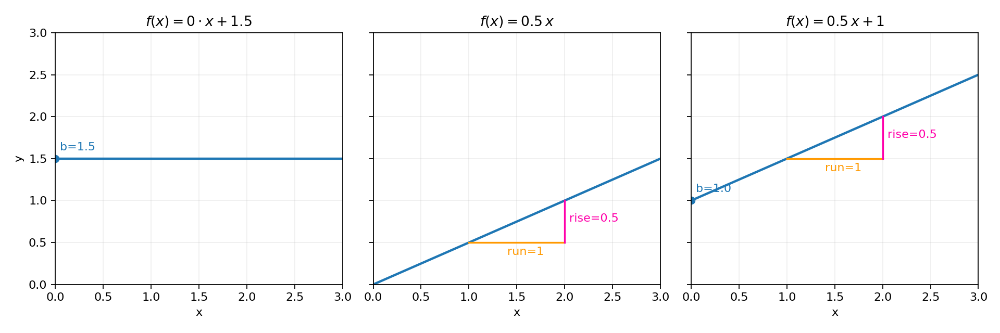
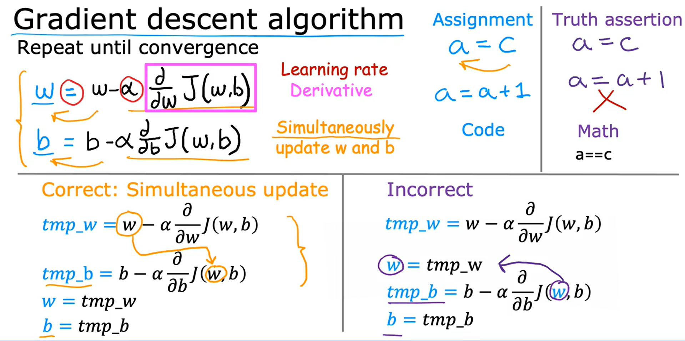

### Table of Contents

- [Module 1 — Introduction to Machine Learning](#module-1--introduction-to-machine-learning)
  - [Lecture 1: Welcome to Machine Learning](#lecture-1-welcome-to-machine-learning)
    - [Quick summary (L1)](#quick-summary-l1)
    - [What is ML (in simple words)](#what-is-ml-in-simple-words)
    - [Everyday examples](#everyday-examples)
    - [Industry examples](#industry-examples)
    - [Why now](#why-now)
    - [Key terms (L1)](#key-terms-l1)
    - [Remember (L1)](#remember-l1)
    - [Next steps (L1)](#next-steps-l1)
  - [Lecture 2: Applications of Machine Learning](#lecture-2-applications-of-machine-learning)
    - [Quick summary (L2)](#quick-summary-l2)
    - [Why ML is used today](#why-ml-is-used-today)
    - [Where ML is used](#where-ml-is-used)
    - [AGI in one line](#agi-in-one-line)
    - [Impact and value](#impact-and-value)
    - [Opportunities beyond software](#opportunities-beyond-software)
    - [Why learn ML now](#why-learn-ml-now)
    - [Next steps (Course)](#next-steps-course)
  - [Lecture 3: What is Machine Learning](#lecture-3-what-is-machine-learning)
    - [Quick summary (L3)](#quick-summary-l3)
    - [Simple definition (Samuel)](#simple-definition-samuel)
    - [Checkers example (self-play)](#checkers-example-self-play)
    - [More data usually helps (L3)](#more-data-usually-helps-l3)
    - [Types of ML (overview)](#types-of-ml-overview)
    - [Tools vs know-how](#tools-vs-know-how)
    - [Next steps (L3)](#next-steps-l3)
  - [Lecture 4: Supervised Learning (Part 1)](#lecture-4-supervised-learning-part-1)
    - [Quick Summary (L4)](#quick-summary)
    - [What is supervised learning?](#what-is-supervised-learning)
    - [Two types: Regression and Classification](#two-types-regression-and-classification)
    - [Common x→y examples](#common-xy-examples)
    - [Example: predict house price](#example-predict-house-price)
    - [Pick the right model complexity](#pick-the-right-model-complexity)
    - [How training works](#how-training-works)
    - [Key words (L4)](#key-words-l4)
    - [Regression vs classification (which to use?)](#regression-vs-classification-which-to-use)
    - [Regenerate the figure](#regenerate-the-figure)
  - [Lecture 5: Supervised Learning (Part 2)](#lecture-5-supervised-learning-part-2)
    - [Quick Summary (L5)](#quick-summary-1)
    - [What is classification?](#what-is-classification)
    - [Binary vs multi-class](#binary-vs-multi-class)
    - [Build intuition: 1D and 2D](#build-intuition-1d-and-2d)
    - [Idea: decision boundary](#idea-decision-boundary)
    - [Tips for beginners (L5)](#tips-for-beginners-l5)
    - [At a glance: supervised vs unsupervised](#at-a-glance-supervised-vs-unsupervised)
  - [Lecture 6: Unsupervised Learning (Part 1)](#lecture-6-unsupervised-learning-part-1)
    - [Quick Summary (L6)](#quick-summary-l6)
    - [What is unsupervised learning?](#what-is-unsupervised-learning)
    - [Clustering basics](#clustering-basics)
    - [Workflow diagram](#workflow-diagram-1)
    - [Examples: news, genetics, customers](#examples-news-genetics-customers)
    - [Beginner tips (L6)](#beginner-tips-l6)
  - [Lecture 7: Unsupervised Learning (Part 2)](#lecture-7-unsupervised-learning-part-2)
    - [Quick Summary (L7)](#quick-summary-l7)
    - [Formal definition](#formal-definition)
    - [Types of Unsupervised Learning](#types-of-unsupervised-learning)
    - [Is this UL or SL? Examples](#is-this-ul-or-sl-examples)
  - [Lecture 8: Linear Regression With One Variable](#lecture-8-linear-regression-with-one-variable)
    - [Linear Regression Model (Part 1)](#linear-regression-model-part-1)
      - [Quick Summary (L8)](#quick-summary-l8)
      - [What is a linear regression model?](#what-is-a-linear-regression-model)
      - [Regression vs classification (recap)](#regression-vs-classification-recap)
      - [Why is it Supervised Learning?](#why-is-it-supervised-learning)
      - [Notation (Standard ML Terminology)](#notation-standard-ml-terminology)
      - [Plot and table view](#plot-and-table-view)
      - [Text data table (sample rows)](#text-data-table-sample-rows)
      - [How to read the table (text-only examples)](#how-to-read-the-table-text-only-examples)
      - [Train then predict (client's house)](#train-then-predict-clients-house)
      - [Generated example (1250 sq ft prediction)](#generated-example-1250-sq-ft-prediction)
      - [Intuition: best-fitting line](#intuition-best-fitting-line)
      - [Generated figure](#generated-figure-1)
      - [Beginner tips (L8)](#beginner-tips-l8)
  - [Lecture 9: Linear Regression With One Variable](#lecture-9-linear-regression-with-one-variable)
    - [Linear Regression Model (Part 2)](#linear-regression-model-part-2)
      - [Quick Summary (L9)](#quick-summary-l9)
      - [Training Set: Inputs and Outputs](#training-set-inputs-and-outputs)
      - [From training set to model f](#from-training-set-to-model-f)
      - [Prediction vs target: y-hat vs y](#prediction-vs-target-y-hat-vs-y)
      - [Linear model form: f(x) = w x + b](#linear-model-form-fx--w-x--b)
      - [Why Use Linear Functions?](#why-use-linear-functions)
      - [Workflow diagram](#workflow-diagram-2)
      - [What’s next: cost function](#whats-next-cost-function)
  - [Lecture 10: Linear Regression With One Variable](#lecture-10-linear-regression-with-one-variable)
    - [Cost Function for Linear Regression (J(w,b))](#cost-function-for-linear-regression-jwb)
      - [Quick Summary (L10)](#quick-summary-l10)
      - [What is the Cost Function?](#what-is-the-cost-function)
      - [Why Do We Need a Cost Function?](#why-do-we-need-a-cost-function)
      - [Parameters w and b](#parameters-w-and-b)
      - [What are w and b?](#what-are-w-and-b)
      - [Errors and squared error](#errors-and-squared-error)
      - [Cost function J(w,b)](#cost-function-jwb)
      - [Why average and 1/(2m)?](#why-average-and-12m)
      - [Intuition](#intuition)
      - [Workflow diagram](#workflow-diagram-3)
  - [Lecture 11: Linear Regression With One Variable](#lecture-11-linear-regression-with-one-variable)
    - [Cost Function Intuition (Part 4)](#cost-function-intuition-part-4)
      - [Quick Summary (L11)](#quick-summary-l11)
      - [Setup: simplified model f(x) = w x](#setup-simplified-model-fx--w-x)
      - [Scenario plots: w = 1, 0.5, 0, -0.5](#scenario-plots-w--1-05-0--05)
      - [Building J(w) point by point](#building-jw-point-by-point)
      - [Takeaway: choose w to minimize J(w)](#takeaway-choose-w-to-minimize-jw)
      - [Step‑by‑step example: compute J(w,b) cost tables (b = 0)](#step-by-step-example-compute-jwb-cost-tables-b--0)
      - [Cost surface (J(w,b)) and contour](#cost-surface-jwb-and-contour)
  - [Lecture 12: Linear Regression With One Variable](#lecture-12-linear-regression-with-one-variable)
    - [Visualizing the Cost Function](#visualizing-the-cost-function)
      - [Quick Summary (L12)](#quick-summary-l12)
      - [Recap](#recap)
      - [Cost Function with One Parameter (w only)](#cost-function-with-one-parameter-w-only)
      - [From bad fit to J(w,b)](#from-bad-fit-to-jwb)
      - [What Does J(w, b) Look Like?](#what-does-jw-b-look-like)
      - [3D bowl: J(w,b) surface](#3d-bowl-jwb-surface)
      - [Contour plot intuition](#contour-plot-intuition)
      - [Regenerate the figures (L12)](#regenerate-the-figures-l12)
      - [Beginner tips (L12)](#beginner-tips-l12)
      - [Key takeaways (L12)](#key-takeaways-l12)
  - [Lecture 13: Linear Regression With One Variable](#lecture-13-linear-regression-with-one-variable)
    - [Visualization Examples](#visualization-examples)
      - [Quick Summary (L13)](#quick-summary-l13)
      - [Examples: different (w,b) and their costs](#examples-different-wb-and-their-costs)
      - [What to look for on the plots](#what-to-look-for-on-the-plots)
      - [Try it yourself (L13 figures)](#try-it-yourself-l13-figures)
      - [What’s next: Gradient Descent](#whats-next-gradient-descent)
  - [Lecture 14: Training Linear Regression — Gradient Descent](#lecture-14-training-linear-regression--gradient-descent)
    - [Quick Summary (L14)](#quick-summary-l14)
    - [What is gradient descent?](#what-is-gradient-descent)
    - [Goal of Gradient Descent](#goal-of-gradient-descent)
    - [Start with an initial guess](#start-with-an-initial-guess)
    - [How it moves: steepest descent](#how-it-moves-steepest-descent)
    - [Local vs global minimum](#local-vs-global-minimum)
    - [Works beyond linear regression](#works-beyond-linear-regression)
    - [Beginner tips (L14)](#beginner-tips-l14)
  - [Lecture 15: Training Linear Regression](#lecture-15-training-linear-regression)
    - [Implementing Gradient Descent](#implementing-gradient-descent)
      - [Quick Summary (L15)](#quick-summary-l15)
      - [Update rules (w and b)](#update-rules-w-and-b)
      - [Learning rate α (alpha)](#learning-rate--alpha)
      - [Assignment vs equality (coding vs math)](#assignment-vs-equality-coding-vs-math)
      - [Simultaneous update: correct](#simultaneous-update-correct)
      - [Non‑simultaneous update: incorrect](#non-simultaneous-update-incorrect)
      - [Pseudocode](#pseudocode)
      - [Beginner tips (L15)](#beginner-tips-l15)
      - [What’s next: derivatives intuition](#whats-next-derivatives-intuition)
  - [Lecture 16: Training Linear Regression](#lecture-16-training-linear-regression)
    - [Gradient Descent Intuition](#gradient-descent-intuition)
      - [Quick Summary (L16)](#quick-summary-l16)
      - [1-parameter view: J(w)](#1-parameter-view-jw)
      - [Positive vs negative slope](#positive-vs-negative-slope)
      - [What Does the Derivative Tell Us?](#what-does-the-derivative-tell-us)
      - [Derivative is Positive (Slope going UP)](#derivative-is-positive-slope-going-up)
      - [Case 2: Derivative is Negative (Slope going DOWN)](#case-2-derivative-is-negative-slope-going-down)
      - [Generated figure (L16)](#generated-figure-l16)
      - [Why Gradient Descent Makes Sense](#why-gradient-descent-makes-sense)
  - [Lecture 17: Training Linear Regression](#lecture-17-training-linear-regression)
    - [Learning Rate](#learning-rate)
      - [Quick Summary (L17)](#quick-summary-l17)
      - [If α is too small](#if--is-too-small)
      - [If α is too large](#if--is-too-large)
      - [At a minimum: gradient is zero](#at-a-minimum-gradient-is-zero)
      - [Why fixed α can still reach a minimum](#why-fixed--can-still-reach-a-minimum)
      - [Generated figures (L17)](#generated-figures-l17)
  - [Lecture 18: Training Linear Regression](#lecture-18-training-linear-regression)
    - [Gradient Descent for Linear Regression](#gradient-descent-for-linear-regression)
      - [Quick Summary (L18)](#quick-summary-l18)
      - [Model, cost, and update rule](#model-cost-and-update-rule)
      - [Gradients (no calculus required)](#gradients-no-calculus-required)
      - [Derivatives (optional)](#derivatives-optional)
      - [Convex cost: one global minimum](#convex-cost-one-global-minimum)
      - [Generated figure (L18)](#generated-figure-l18)

## Module 1 — Introduction to Machine Learning

### Lecture 1: Welcome to Machine Learning

### Quick summary (L1)

Machine learning (ML) is the science of getting computers to learn from data without being explicitly programmed. You already encounter ML daily: ranking web search results, tagging friends in photos, getting movie recommendations, using voice assistants, and filtering spam. Beyond consumer apps, ML is transforming industry—optimizing renewable energy, assisting medical diagnosis, and automating visual inspection in factories. In this course, you will learn core ML ideas and implement them in code.

### What is ML (in simple words)

- **Practical definition**: ML enables software to improve performance on tasks by learning patterns from data, rather than following hand‑written rules.
- **Why it matters**: Modern data scale and computing power let ML solve problems too complex for explicit programming.

### Everyday examples

- **Search ranking**: Systems like Google, Bing, and Baidu learn to rank web pages so you find useful answers (e.g., “how do I make a sushi roll?”).
- **Face recognition and photo tagging**: Apps can recognize friends in images and suggest labels.
- **Recommendations**: Streaming platforms suggest movies similar to what you’ve watched (e.g., after a Star Wars movie).
- **Speech recognition and voice assistants**: Dictation and commands like “Hey Siri, play a song by Rihanna” or “OK Google, show me Indian restaurants near me.”
- **Spam detection**: Email services flag suspicious messages (e.g., “Congratulations! You’ve won a million dollars”).

### Industry examples

- **Renewable energy optimization**: Improving wind turbine power generation using predictive models and control.
- **Healthcare support**: Assisting clinicians in making more accurate diagnoses.
- **Manufacturing quality inspection**: Computer vision on assembly lines to detect defects (e.g., Landing AI deployments).

### Why now?

- **Data availability**: Abundant digital activity generates labeled and unlabeled data.
- **Compute**: Affordable, scalable hardware accelerates training and inference.
- **Algorithms**: Advances in models and training techniques drive real‑world performance.

### Key terms (L1)

- **Ranking**: Ordering items (e.g., web pages) by relevance learned from data.
- **Computer vision**: Enabling computers to understand images and video (e.g., face recognition, defect detection).
- **Recommendation systems**: Predicting what a user will like based on behavior and content.
- **Speech recognition**: Converting spoken language to text; used in voice assistants.
- **Spam filtering**: Classifying messages as spam vs. legitimate.

### Remember (L1)

- **ML is already everywhere** in consumer apps and industry.
- **Definition to remember**: Getting computers to learn without explicit programming.
- **You will build**: Practical ML implementations as part of this course.

---

### Lecture 2: Applications of Machine Learning

### Quick summary (L2)

This lecture surveys why ML has become the dominant approach for many AI problems, highlights real‑world application areas across consumer and industrial domains, provides perspective on Artificial General Intelligence (AGI), and notes the large economic impact and career opportunity driving demand for ML skills.

### Why ML is used today

- Traditional programming can solve simple, rule-based problems (like finding the shortest GPS route), but…
- Many useful tasks—web search, speech recognition, diagnosing X-rays, self-driving cars—are far too complex to describe with explicit rules.
- ML, a sub‑field of AI, enables systems to learn patterns and solutions directly from data, rather than relying on hand-crafted instructions.

### Where ML is used

- **Consumer and platform**: Web search ranking, speech recognition, computer vision for maps/Street View, online advertising, AR, fraud detection, recommendations.
- **Industrial and enterprise**: Factory visual inspection, large‑scale agriculture, healthcare support and diagnosis, e‑commerce.
- These examples reflect work from efforts such as Google Brain, Baidu AI, Landing AI, AI Fund, and Stanford collaborations.

### AGI in one line

- **AGI (Artificial General Intelligence)** aims for human‑level general intelligence; it is widely considered far away and often overhyped.
- Timeline is uncertain (decades to centuries). A plausible path forward continues to rely on learning algorithms, potentially inspired by the brain.
- This course will revisit the AGI discussion later for broader context.

### Impact and value

- Studies (e.g., McKinsey) estimate AI/ML could generate roughly $13T in additional annual value by 2030.
- While software has seen large gains already, even greater value likely lies in non‑software sectors.

### Opportunities beyond software

- Significant untapped applications in retail, travel, transportation, automotive, and materials manufacturing.
- Demand for ML practitioners remains high due to opportunities across many industries.

### Why learn ML now

- The combination of data, compute, and mature methods makes ML broadly practical.
- Learning these skills opens doors to contribute across diverse, impactful application areas.

---

### Lecture 3: What is Machine Learning

### Quick summary (L3)

Machine learning enables computers to learn from data without being explicitly programmed. Arthur Samuel’s checkers program is a classic illustration: by playing tens of thousands of games against itself, it learned which positions lead to wins and became stronger than its creator. More learning opportunities generally yield better performance. This lecture also previews the major types of ML and emphasizes practical know‑how for applying algorithms effectively.

### Simple definition (Samuel)

- “The field of study that gives computers the ability to learn without being explicitly programmed.”
- Focuses on learning behaviors from data rather than writing exhaustive rules.

### Checkers example (self-play)

- The program improved by self‑play: the computer generated massive experience by playing itself.
- It learned to evaluate positions by correlating them with eventual wins/losses.
- Sufficient experience allowed it to surpass Samuel’s own checkers ability.

### More data usually helps (L3)

- More training data/experience typically improves model performance; dramatically less experience tends to hurt.

### Types of ML (overview)

- Two primary categories introduced: **supervised learning** and **unsupervised learning** (formal definitions next).
- In practice, supervised learning powers many real‑world systems and has advanced rapidly.
- Specialization structure: Courses 1–2 focus on supervised learning; Course 3 covers unsupervised learning, **recommender systems**, and **reinforcement learning**.

### Tools vs know-how

- It’s not enough to just know ML algorithms; knowing how to apply them correctly is essential.
- Like having advanced tools, knowing the practical recipes and best practices lets you build real, valuable ML systems.
- Common mistake: Experienced teams sometimes spend months on approaches that won’t work. Knowing best practices helps avoid wasted effort.

---

### Lecture 4: Supervised Learning (Part 1)

### Quick Summary

Supervised learning learns a mapping from inputs x to outputs y using example pairs (x, y). After training on many labeled examples, the model predicts y for new x. Two major problem types: regression (predict a number) and classification (predict a category).

### What is supervised learning?

- 99% of today's machine learning economic value comes from supervised learning.
- Supervised learning means an algorithm learns mappings from input x to output y.
- You give the algorithm examples with the “right answer” (labels y) for each input x.
- The model learns a function f that maps x → y and can generalize to unseen x.

### Two types: Regression and Classification

- **Regression**: Predict a number with many possible values.
  - Examples: house price, temperature, sales next week.
- **Classification**: Predict a category from a small set of labels.
  - Examples: spam vs not spam, benign vs malignant, digit 0–9.

### Common x→y examples

- Email: Input is an email (x), output is whether it's spam or not (y). (classification)
- Speech recognition: Input is an audio clip, output is the transcript (text).
- Machine translation: Input is English text, output is translated text.
- Online advertising: Input is ad/user info, output is probability of clicking (key to revenue for tech companies).
- Self-driving cars: Input is images/radar data from sensors, output is positions of other cars.
- Manufacturing visual inspection: Input is a product image, output is whether there's a defect.

| Input (x)         | Output (y)             | Application         |
| ----------------- | ---------------------- | ------------------- |
| email             | spam? (0/1)            | spam filtering      |
| audio             | text transcript        | speech recognition  |
| English           | Spanish                | machine translation |
| ad, user info     | click? (0/1)           | online advertising  |
| image, radar info | position of other cars | self-driving car    |
| image of phone    | defect? (0/1)          | visual inspection   |

### Example: predict house price

- Input x: house size (sq ft). Output y: price (dollars).
- Fit a simple model (e.g., a straight line) or a more flexible curve to the data.
- Use the model to predict the price for a new house size (e.g., 750 sq ft).

Housing price vs. size (conceptual)


### Pick the right model complexity

- Straight line = simpler, less flexible; curve = more flexible.
- Goal is not to pick the line that gives the “best” answer for one example, but to choose complexity that generalizes well.
- Later you’ll learn how to select appropriate complexity systematically (avoid under/overfitting).

### How training works


### Key words (L4)

- **Supervised learning:** Learn x → y from labeled examples.
- **Label (y):** The correct answer for an input x.
- **Regression:** Predict a continuous number (e.g., house price).
- **Classification:** Predict a category/class (e.g., spam vs not spam).

### Regression vs classification (which to use?)

- If the answer you want is a number that can smoothly go up or down, use regression.
  - Examples: price, temperature, time to deliver, demand next week.
- If the answer is a label from a small set of choices, use classification.
  - Examples: spam or not, disease A/B/C, clicked or not, defect yes/no.
- Quick check: Look at your label y. Numbers with many possible values → regression. A few named categories (or 0/1) → classification.

### Regenerate the figure

- Open a terminal in the project root and run:
  - Windows PowerShell:
    - `python -m pip install -r "Module 1/script/requirements.txt"`
    - `python "Module 1/script/generate_regression_plot.py"`
- The image will be saved to `Module 1/assets/regression_price_prediction.png` and is referenced above.

---

### Lecture 5: Supervised Learning (Part 2)

### Quick Summary

Classification is the other main type of supervised learning. Instead of predicting a number (regression), you predict a category from a small set of options (e.g., benign vs malignant). You can have two classes (binary) or more (multi‑class). Intuitively, the model learns a boundary that separates classes based on input features.

### What is classification?

- Classification is a type of supervised learning where the goal is to predict categories (also called classes or labels).
- Unlike regression which predicts numbers (often infinitely many possible values), classification predicts a small set of possible outputs.
- Learns x → y where y is a category/label, not a continuous number.
- Output examples: benign/malignant, spam/not‑spam, cat/dog, digit 0–9.
- Labels can be written as numbers (0,1,2,…) but they represent categories.

### Example: Breast Cancer Detection

- Task: Use patient data to classify tumors as:

  - Benign (0): Not cancerous, not dangerous

  - Malignant (1): Cancerous, potentially dangerous

- Input features could be tumor size, patient age, cell uniformity, etc.

- Graphically, the tumor size might map to either category 0 or 1.

### Examples of Classification

- Spam detection (spam / not spam)
- Image recognition (cat / dog / bird / etc.)
- Medical diagnosis (benign / malignant tumors)
- Customer purchase behavior (will buy / won’t buy)

### Binary vs multi-class

- **Binary classification:** only two choices.
  - Examples: benign vs malignant, spam vs not spam, fraud vs not fraud.


- **Multi‑class classification:** three or more choices.
  - Examples: cancer type 0/1/2, animal cat/dog/bird, review sentiment negative/neutral/positive.


### Build intuition: 1D and 2D

- 1D feature (e.g., tumor size): plot points on a line, labels 0 or 1.
  
- 2D features (e.g., age and tumor size): plot points on a plane; circles vs crosses show classes.
  
- Real problems often use many features (dozens to hundreds) like cell shape and texture.

### Idea: decision boundary

- The learning algorithm finds a boundary that best separates classes.
- New examples are classified by which side of the boundary they fall on.
- Boundaries can be straight (linear) or curved (nonlinear), depending on the model.


### Tips for beginners (L5)

- If your target has a few named options → classification; if it’s a wide‑range number → regression.
- Start simple (linear models) and add complexity if needed.
- Always check class balance; if one class is rare, use metrics beyond accuracy (e.g., precision/recall).

### At a glance: supervised vs unsupervised

- Regression: predict a number from infinitely many possible values.
  - Examples: house price, temperature tomorrow, time to deliver a package.
- Classification: predict a category from a small set of options.
  - Examples: spam vs not spam, benign vs malignant, digit 0–9, clicked vs not clicked.
    > Tip: Look at your label y. Numbers with many possible values → regression. A few discrete labels → classification.

---

### Lecture 6: Unsupervised Learning (Part 1)

### Quick Summary (L6)

Unsupervised learning works without **labels (y)**. The algorithm looks at raw data (no “right answers”) and discovers **patterns** or **structure** on its own. A common task is **clustering**—grouping similar items together.

### What is unsupervised learning?

- **Input only data (x), no labels (y).**
- **Goal:** find **patterns**, **groups**, or **structure** in the data.
- Called **unsupervised** because we do not provide the “right answer” for each example.

### Clustering basics

- **Clustering** groups similar examples into **clusters** purely from the data.
- **Clusters** are groups where points in the same group are similar to each other.
- The **number of clusters** may be decided by the algorithm or specified by you.
- **Output:** group assignments; there is no “correct label” provided ahead of time.

### Workflow diagram


### Example: patients without labels

- **Dataset:** patient tumor size and age, but without labels like benign or malignant.
- **Task:** find **natural groups** (clusters) in the data.
- The algorithm might find two or more clusters indicating different types or categories, even without knowing what they represent.
- The algorithm groups data into clusters:
  - **Group 1** (possible benign)
  - **Group 2** (possible malignant)


### Examples: news, genetics, customers

- **News articles (Google News):** Every day, thousands of articles are published. **Clustering** groups related stories by shared words (e.g., “**panda**,” “**twins**,” “**zoo**”). No one hard‑codes topics—the algorithm discovers them automatically.


- **Genetics (DNA microarray):** Group people by similar **gene activity** patterns to reveal **types/subgroups** without pre‑labeled categories. Each **row = gene**, **column = individual**. Applications: discovering genetic traits, disease types, etc.


- **Customers (market segmentation):** Group users into **segments** (e.g., skill growth, career change, stay‑updated) to tailor products and communication.


### Beginner tips (L6)

- Use **unsupervised learning** when you don’t have labels but still want insights (**groups**, **anomalies**, **structure**).
- **Clustering** is for “who is similar to whom?” questions. Choose **features** that reflect meaningful similarity.
- Start simple (e.g., **k‑means**) and check if clusters make sense to domain experts.

---

### Lecture 7: Unsupervised Learning (Part 2)

### Quick Summary (L7)

Unsupervised learning uses data with inputs **x only** (no labels **y**). The goal is to discover **structure**. Beyond **clustering**, two important types are **anomaly detection** (find unusual points) and **dimensionality reduction** (compress data while keeping key information).

### Formal definition

- **Supervised:** have **(x, y)** pairs; learn mapping **x → y**.
- **Unsupervised:** have **x only**; learn patterns or structure in **x**.

### Types of Unsupervised Learning

- **Clustering:** Groups data points into clusters based on similarity. Commonly used in applications such as:
  - Grouping news articles by topic (e.g., Google News).
  - Market segmentation by customer behavior.
  - Biological data grouping like genetic types.
- **Anomaly Detection:** find **unusual** or **rare** events (e.g., credit card **fraud**).
- **Dimensionality Reduction:** **compress** high‑dimensional data into fewer dimensions while keeping the most **important information**.

### Is this UL or SL? Examples

- **Spam filtering:** if emails are labeled spam/not spam → **Supervised** (classification).
- **Google News topic grouping:** group related articles by shared words → **Unsupervised** (**clustering**).
- **Market segmentation:** find customer groups from behavior data → **Unsupervised** (**clustering**).
- **Diagnosing diabetes:** labeled examples diabetes/not diabetes → **Supervised** (classification), similar to the **breast cancer** example.

---

### Lecture 8: Linear Regression With One Variable

#### Linear Regression Model (Part 1)

### Quick Summary (L8)

**Linear regression** fits a **straight line** to relate an input **x** (e.g., house size) to an output **y** (e.g., price). Using a **Portland housing dataset** (size vs price), we learn the line and then **predict** price for a new size.

### What is a linear regression model?

- Linear Regression is one of the most widely used supervised learning models..
- It fits a straight line to training data, modeling the relationship between input and output.
- Input example: size of a house (in square feet).
- Output example: price of the house (in thousands of dollars).

### Regression vs classification (recap)

- **Regression** outputs a **number** (infinitely many possibilities), e.g., price $220,000.
- **Classification** outputs a **category** (small, discrete set), e.g., cat vs dog, or one of 10 diagnoses.

### Why is it Supervised Learning?

- Because the training data includes both:
  - Input (x): house size
  - Output (y): house price
- The model is trained on labeled data: each training example contains input `x (house size)` and correct output `y (house price)`.
- Model learns from examples with the **“right answers”** provided.

### Plot and table view

- Two views of the same data:

  - **Plot view:** each cross is a house (size on x‑axis, price on y‑axis).
  - **Table view:** each row has **size (x)** and **price (y)**.

    

### Notation (Standard ML Terminology)


- **x**: input feature (house size in sq ft)
- **y**: target value (price in $1000s)
- **Training set:** many **(x, y)** pairs used to train the model.
- **m**: total number of training examples (e.g., **m = 47** in the Portland set).
- Single example: **(x, y)**, e.g., **(2104, 400)**.
- i‑th example notation: \(x^{(i)}\) and \(y^{(i)}\) mean the values from row i.

> Note: the superscript (i) is an **index**, not an exponent.

### Train then predict (client's house)

- Your **client’s house** is not in the training set (not yet sold → unknown price).
- Workflow: **train** on known sales (training set) → **predict** the client’s price using the learned line.
- Example from the lecture: if **x = 1250 sq ft**, the model predicts roughly **$227k** by reading off the best‑fit line.

Example (1250 sq ft prediction)


### Text data table (sample rows)

| i   | x (size in sq ft) | y (price in $1000s) |
| --- | ----------------- | ------------------- |
| 1   | 2104              | 400                 |
| 2   | 1416              | 232                 |
| 3   | 1534              | 315                 |
| 4   | 852               | 178                 |
| …   | …                 | …                   |
| 47  | 3210              | 870                 |

### How to read the table (text-only examples)

- There are **m = 47** training examples (rows).
- The first example is \((x^{(1)}, y^{(1)}) = (2104, 400)\): a 2,104 sq ft house sold for $400k.
- The second example is \((x^{(2)}, y^{(2)}) = (1416, 232)\): a 1,416 sq ft house sold for $232k.
- Each row provides a **correct answer** (label **y**) for its **input** (feature **x**). The model learns a line that best fits all these pairs.

### Intuition: best-fitting line

- Many lines are possible; choose the one that **minimizes error** between predictions and actual prices.
- Visually: pick the line that stays **closest to the cloud of points** across the dataset.

### Generated figure


### Beginner tips (L8)

- **Supervised vs classification reminder:** Linear regression is **supervised** and solves a **regression** problem (outputs a number). **Classification** outputs categories (e.g., cat/dog).
- Start with a **single feature** to build intuition; add more features later.
- Don’t overthink the formula. Focus on: line goes up → larger x predicts larger y (**positive slope**); line goes down → **negative slope**.
- If predictions look off in a region, consider a **curve** (polynomial) or more **features**.

---

### Lecture 9: Linear Regression With One Variable

#### Linear Regression Model (Part 2)

### Quick Summary (L9)

Supervised learning takes a **training set** with inputs **x** and targets **y**, and learns a **function f (the model)** that maps x → **ŷ** (y‑hat, the **prediction**). For linear regression, we use a **straight line**: **f(x) = w x + b**. Next, we’ll design a **cost function** to measure how good the line is.

### Training Set: Inputs and Outputs

- A supervised learning algorithm requires a **training set** that contains both:
  - **Input features** (e.g., size of the house)
  - **Output targets** (e.g., price of the house)
- Outputs (**targets**) are the **right answers** the model will learn from.

### From training set to model f

- **Input:** training set with both **features x** (e.g., house size) and **targets y** (e.g., price).
- **Training:** feed (x, y) to a **learning algorithm** to produce a **function f** (the **model**).
- **Use:** given a new **x**, the model outputs a **prediction ŷ = f(x)**.

```mermaid
graph LR
  A[Training set x and y] --> B[Learning algorithm]
  B --> C[Model f]
  D[New input x] --> C
  C --> E[Prediction ŷ y_hat]
```



<br/>


### Prediction vs target: y-hat vs y

- **y (target):** the **true target value** in the dataset (known only
  for training examples; unknown for a new
  house until sold).
- **ŷ (y‑hat, prediction):** the model’s **estimate** of y.

### Linear model form: f(x) = w x + b

- We write the linear function as **f(x) = w · x + b**.
- **w** (weight/slope) controls how much **y** changes per unit change in **x**
- **b** (bias/intercept) shifts the line up/down.
- Notation variants: **\(f(x)\)** or **\(f\_{w,b}(x)\)** mean the same function with parameters **\(w, b\)**.
- This **\(f\_{w,b}(x)\)** of **x** means **f** is a function that takes **x** as input, and depending on the values of **w** and **b**, **f** will output some value of a prediction **ŷ (y-hat)**.


### Why Use Linear Functions?

- A **linear** model is easy to train and reason about; it’s a strong **foundation** before moving to non‑linear curves.
- You can later extend to **polynomials** or **multiple features** (number of bedrooms, location, etc.).

### Workflow diagram


### What’s next: cost function

- We need a **cost function** to quantify how far **ŷ** is from **y** across all training examples.
- **Minimizing** this cost will choose the best **w** and **b**.

---

How to regenerate the figure (Windows PowerShell)

- `python -m pip install -r "Module 1/script/requirements.txt"`
- `python "Module 1/script/generate_linear_regression_plot.py"`
- `python "Module 1/script/generate_linear_regression_with_table.py"`
- `python "Module 1/script/generate_linear_regression_pred_1250.py"`

---

### Lecture 10: Linear Regression With One Variable

#### Cost Function for Linear Regression (J(w,b))

### Quick Summary (L10)

To train linear regression, we measure how good a line is with a **cost function**. For each training example, compute the **error** (prediction **ŷ** minus **target y**), **square** it, and **average** across all examples. The cost is **J(w,b)**; our goal is to find **w, b** that make **J** small.

### What is the Cost Function?

- The cost function is a mathematical tool that measures how well a linear regression model's predictions match the actual data.
- It tells us **how good or bad** our model is at predicting the correct value for each data point.

### Why Do We Need a Cost Function?

- When training a model, we want our line (prediction function) to fit the data well.
- But how do we measure if the line is good or bad?
  👉 That’s what the cost function does — it tells us how well (or poorly) the model is doing.
- The cost function gives a **score** for the model:

  - A **low score** means predictions are close to the real values (good fit).

  - A **high score** means predictions are far from the real values (bad fit).

### Parameters w and b

- Model: **f<sub>w,b</sub>(x) = w x + b**. The numbers **w** and **b** are the model **parameters** (also called **weights** or **coefficients**).
- Changing **w** changes the **slope**; changing **b** moves the line up/down (**y‑intercept**).

Training set snapshot (for intuition)

| x (size in sq ft) | y (price in $1000s) |
| ----------------- | ------------------- |
| 2104              | 460                 |
| 1416              | 232                 |
| 1534              | 315                 |
| 852               | 178                 |

Model equation

- f<sub>w,b</sub>(x) = w x + b
- Given x, the model outputs the prediction ŷ = f<sub>w,b</sub>(x).

w and b variations (generated)



### Errors and squared error

- For example (i): prediction is **ŷ<sup>(i)</sup> = f(x<sup>(i)</sup>) = w · x<sup>(i)</sup> + b**.
- **Error** for example (i): **ŷ<sup>(i)</sup> − y<sup>(i)</sup>**.
- **Squared error**: **(ŷ<sup>(i)</sup> − y<sup>(i)</sup>)<sup>2</sup>**. Squaring keeps errors positive (no canceling out) and penalizes large mistakes.

### Cost function J(w,b)

- Over **m** examples, average the squared errors:

```math
J(w,b) = \frac{1}{2m} \sum_{i=1}^{m} \big( f(x^{(i)}) - y^{(i)} \big)^2
```

- Equivalent using $\hat{y}$:

```math
J(w,b) = \frac{1}{2m} \sum_{i=1}^{m} \big( \hat{y}^{(i)} - y^{(i)} \big)^2
```

### What are w and b?

- **w (slope/weight)**: how fast the prediction changes when **x** increases by 1. Bigger **w** → steeper upward line; negative **w** → line slopes downward.
- **b (y‑intercept/bias)**: the prediction when **x = 0**. It slides the whole line up or down.
- Together: **w sets the tilt**, **b sets the height**. Changing **w** and **b** changes how well the line fits the data.


### How it works (step‑by‑step)

- **Prediction**: for each example (i), compute **ŷ<sup>(i)</sup> = f(x<sup>(i)</sup>)** using the current **w, b**.
- **Error**: The error is the difference between the predicted value and the true value **(ŷ<sup>(i)</sup> − y<sup>(i)</sup>)**.
- **Squaring**: The error is squared **(ŷ<sup>(i)</sup> − y<sup>(i)</sup>)<sup>2</sup>** so that negatives/positives don’t cancel out and large mistakes count more than small ones.
- **Averaging**: average the squared errors over **m** examples to evaluate overall fit.

Cost function formula

```math
J(w,b) = \frac{1}{2m} \sum_{i=1}^{m} \big( f(x^{(i)}) - y^{(i)} \big)^2
```

- **m**: number of training examples.
- **f(x<sup>(i)</sup>)**: prediction for example **i**.
- The **1/(2m)** factor is conventional and makes calculus cleaner later.


### Why average and 1/(2m)?

- **Average (1/m)** makes J comparable across datasets of different sizes.
- The extra **1/2** makes math cleaner later (derivatives drop a 2 factor).

### Why Do We Use the Cost Function?

- The goal in training is to find the values of w and b that make the cost function as small as possible.
- A smaller cost means better predictions — so the algorithm uses the cost function to optimize the model.

### Intuition

- **If the cost function J(w, b) is large** → model predictions are far from actual values (bad fit) or the model is making big prediction errors.
- **If J(w, b) is small** → predictions are close to targets (good fit).

Our goal in linear regression is to **find values of `w` and `b` that make `J(w,b)` as small as possible.**


### Workflow diagram


---

### Lecture 11: Linear Regression With One Variable

#### Cost Function Intuition

### Quick Summary (L11)

We use the **cost function J** to pick parameters that make predictions close to the truth. Using a simple model **f(x) = w x** (set **b = 0**), we vary **w**, see the fitted line, and compute **J(w)**. The best **w** is the one that makes **J(w)** the smallest.

### Setup: simplified model f(x) = w x

- Mock training set: (1,1), (2,2), (3,3)
- Model: **f(x) = w x** (so the line goes through the origin)
- Cost:

```math
J(w) = \frac{1}{2m} \sum_{i=1}^{m} \big( w\,x^{(i)} - y^{(i)} \big)^2
```


- Goal: **Find the value of `𝑤` that minimizes `J(w)`**.

### Scenario plots: w = 1, 0.5, 0, −0.5

left: model fits, right: **J(w)** curve


What’s happening

- **w = 1.0**: each point lies on the line → errors are 0 → **J(w) = 0**
- **w = 0.5**: line is too shallow → errors positive → **J(w) ≈ 0.58**
- **w = 0.0**: flat line → larger errors → **J(w) ≈ 2.33**
- **w = −0.5**: wrong direction → even larger errors → **J(w) ≈ 5.25**


### Building J(w) point by point

- For each **w**, compute **J(w)** from squared errors on all points
- Plot many pairs (w, J(w)) → you trace a smooth curve; the minimum is the best **w**


### Takeaway: choose w to minimize J(w)

- **Linear regression** finds parameters that **minimize the cost**
- With both **w** and **b**, we minimize **J(w,b)** (next: visualize the surface for w and b)

### Step‑by‑step example: compute J(w,b) cost tables (b = 0)

- **Dataset (for clarity)**: `(1, 1), (2, 2), (3, 3)`; **Model**: `f(x) = w × x` (set **b = 0**)

In this walkthrough we keep **b = 0** so the line passes through the origin. We will vary the **slope w** and, for each choice:

- State the **hypothesis**: `f(x) = w × x`
- Compute the **prediction ŷ** for each x
- Compute the **error** `e = ŷ − y`
- Compute the **squared error** `e²`
- Average over the dataset to get the **cost J(w)** using `J(w) = (1/(2m)) Σ e²`

Tip: If **w** is negative, the line tilts down and predictions are below the true **y**; if **w** is too large, predictions overshoot. In both cases, the mistakes get bigger, so the **cost** goes up.

#### <u>Cost for w = -0.5</u>

🎯 w = -0.5

Why this w: **downward slope**; predictions are below the data → larger **errors** → higher **J(w)**.

Step 1: Set up the hypothesis f(x) = -0.5 × x

Step 2: Calculate cost J(-0.5)

| x   | y   | f(x) = -0.5×x | Error | Error² |
| --- | --- | ------------- | ----- | ------ |
| 1.0 | 1.0 | -0.50         | -1.50 | 2.25   |
| 2.0 | 2.0 | -1.00         | -3.00 | 9.00   |
| 3.0 | 3.0 | -1.50         | -4.50 | 20.25  |

**J(-0.5) = (1/6) × (2.25 + 9.00 + 20.25) = 31.50/6 = 5.250**


#### <u>Cost for w = -1.0</u>

🎯 w = -1.0

Why this w: more **negative slope**; even bigger gap to the data → **squared errors** grow.

Step 1: Set up the hypothesis f(x) = -1.0 × x

Step 2: Calculate cost J(-1.0)

| x   | y   | f(x) = -1.0×x | Error | Error² |
| --- | --- | ------------- | ----- | ------ |
| 1.0 | 1.0 | -1.00         | -2.00 | 4.00   |
| 2.0 | 2.0 | -2.00         | -4.00 | 16.00  |
| 3.0 | 3.0 | -3.00         | -6.00 | 36.00  |

**J(-1.0) = (1/6) × (4.00 + 16.00 + 36.00) = 56.00/6 = 9.333**


#### <u>Cost for w = -1.5</u>

🎯 w = -1.5

Why this w: **very steep downward** line; **cost J(w)** increases further.

Step 1: Set up the hypothesis f(x) = -1.5 × x

Step 2: Calculate cost J(-1.5)

| x   | y   | f(x) = -1.5×x | Error | Error² |
| --- | --- | ------------- | ----- | ------ |
| 1.0 | 1.0 | -1.50         | -2.50 | 6.25   |
| 2.0 | 2.0 | -3.00         | -5.00 | 25.00  |
| 3.0 | 3.0 | -4.50         | -7.50 | 56.25  |

**J(-1.5) = (1/6) × (6.25 + 25.00 + 56.25) = 87.50/6 = 14.583**


#### <u>Cost for w = 0.0</u>

🎯 w = 0.0

Why this w: **flat line** `f(x)=0`; the **error** equals `y` for each point → moderate **J(w)**.

Step 1: Set up the hypothesis f(x) = 0.0 × x

Step 2: Calculate cost J(0.0)

| x   | y   | f(x) = 0×x | Error | Error² |
| --- | --- | ---------- | ----- | ------ |
| 1.0 | 1.0 | 0.00       | −1.00 | 1.00   |
| 2.0 | 2.0 | 0.00       | −2.00 | 4.00   |
| 3.0 | 3.0 | 0.00       | −3.00 | 9.00   |

**J(0.0) = (1/6) × (1.00 + 4.00 + 9.00) = 14/6 = 2.333**


#### <u>Cost for w = 0.5</u>

🎯 w = 0.5

Why this w: **shallow upward** line; predictions under‑estimate **y** a bit → smaller **J(w)** than w=0 but not zero.

Step 1: Set up the hypothesis f(x) = 0.5 × x

Step 2: Calculate cost J(0.5)

| x   | y   | f(x) = 0.5×x | Error | Error² |
| --- | --- | ------------ | ----- | ------ |
| 1.0 | 1.0 | 0.50         | −0.50 | 0.25   |
| 2.0 | 2.0 | 1.00         | −1.00 | 1.00   |
| 3.0 | 3.0 | 1.50         | −1.50 | 2.25   |

**J(0.5) = (1/6) × (0.25 + 1.00 + 2.25) = 3.50/6 = 0.583**


#### <u>Cost for w = 1.0</u>

🎯 w = 1.0

Why this w: **ideal slope** for this dataset; **prediction ŷ equals y** for all points → **J(w)=0**.

Step 1: Set up the hypothesis f(x) = 1.0 × x

Step 2: Calculate cost J(1.0)

| x   | y   | f(x) = 1.0×x | Error | Error² |
| --- | --- | ------------ | ----- | ------ |
| 1.0 | 1.0 | 1.00         | 0.00  | 0.00   |
| 2.0 | 2.0 | 2.00         | 0.00  | 0.00   |
| 3.0 | 3.0 | 3.00         | 0.00  | 0.00   |

**J(1.0) = (1/6) × (0.00 + 0.00 + 0.00) = 0.000**


#### <u>Cost for w = 1.5</u>

🎯 w = 1.5

Why this w: **too steep**; predictions overshoot → **errors** grow again → **J(w)** increases.

Step 1: Set up the hypothesis f(x) = 1.5 × x

Step 2: Calculate cost J(1.5)

| x   | y   | f(x) = 1.5×x | Error | Error² |
| --- | --- | ------------ | ----- | ------ |
| 1.0 | 1.0 | 1.50         | 0.50  | 0.25   |
| 2.0 | 2.0 | 3.00         | 1.00  | 1.00   |
| 3.0 | 3.0 | 4.50         | 1.50  | 2.25   |

**J(1.5) = (1/6) × (0.25 + 1.00 + 2.25) = 3.50/6 = 0.583**


#### <u>Cost for w = 2.0</u>

🎯 w = 2.0

Why this w: much **steeper** than the data trend; **squared errors** become larger → higher **cost**.

Step 1: Set up the hypothesis f(x) = 2.0 × x

Step 2: Calculate cost J(2.0)

| x   | y   | f(x) = 2.0×x | Error | Error² |
| --- | --- | ------------ | ----- | ------ |
| 1.0 | 1.0 | 2.00         | 1.00  | 1.00   |
| 2.0 | 2.0 | 4.00         | 2.00  | 4.00   |
| 3.0 | 3.0 | 6.00         | 3.00  | 9.00   |

**J(2.0) = (1/6) × (1.00 + 4.00 + 9.00) = 14/6 = 2.333**


#### <u>Cost for w = 2.5</u>

🎯 w = 2.5

Why this w: even **steeper**; expect noticeably larger **J(w)**.

Step 1: Set up the hypothesis f(x) = 2.5 × x

Step 2: Calculate cost J(2.5)

| x   | y   | f(x) = 2.5×x | Error | Error² |
| --- | --- | ------------ | ----- | ------ |
| 1.0 | 1.0 | 2.50         | 1.50  | 2.25   |
| 2.0 | 2.0 | 5.00         | 3.00  | 9.00   |
| 3.0 | 3.0 | 7.50         | 4.50  | 20.25  |

**J(2.5) = (1/6) × (2.25 + 9.00 + 20.25) = 31.50/6 = 5.250**


#### <u>Cost for w = 3.0</u>

🎯 w = 3.0

Why this w: slope well above the data trend; **errors** and **J(w)** continue to grow.

Step 1: Set up the hypothesis f(x) = 3.0 × x

Step 2: Calculate cost J(3.0)

| x   | y   | f(x) = 3.0×x | Error | Error² |
| --- | --- | ------------ | ----- | ------ |
| 1.0 | 1.0 | 3.00         | 2.00  | 4.00   |
| 2.0 | 2.0 | 6.00         | 4.00  | 16.00  |
| 3.0 | 3.0 | 9.00         | 6.00  | 36.00  |

**J(3.0) = (1/6) × (4.00 + 16.00 + 36.00) = 56.00/6 = 9.333**


#### <u>Cost for w = 3.5</u>

🎯 w = 3.5

Why this w: still steeper; the **cost** rises further.

Step 1: Set up the hypothesis f(x) = 3.5 × x

Step 2: Calculate cost J(3.5)

| x   | y   | f(x) = 3.5×x | Error | Error² |
| --- | --- | ------------ | ----- | ------ |
| 1.0 | 1.0 | 3.50         | 2.50  | 6.25   |
| 2.0 | 2.0 | 7.00         | 5.00  | 25.00  |
| 3.0 | 3.0 | 10.50        | 7.50  | 56.25  |

**J(3.5) = (1/6) × (6.25 + 25.00 + 56.25) = 87.50/6 = 14.583**


#### <u>Cost for w = 4.0</u>

🎯 w = 4.0

Why this w: much steeper; very large **squared errors** → high **J(w)**.

Step 1: Set up the hypothesis f(x) = 4.0 × x

Step 2: Calculate cost J(4.0)

| x   | y   | f(x) = 4.0×x | Error | Error² |
| --- | --- | ------------ | ----- | ------ |
| 1.0 | 1.0 | 4.00         | 3.00  | 9.00   |
| 2.0 | 2.0 | 8.00         | 6.00  | 36.00  |
| 3.0 | 3.0 | 12.00        | 9.00  | 81.00  |

**J(4.0) = (1/6) × (9.00 + 36.00 + 81.00) = 126.00/6 = 21.000**


#### <u>Cost for w = 4.5</u>

🎯 w = 4.5

Why this w: extremely steep; **cost J(w)** becomes quite large.

Step 1: Set up the hypothesis f(x) = 4.5 × x

Step 2: Calculate cost J(4.5)

| x   | y   | f(x) = 4.5×x | Error | Error² |
| --- | --- | ------------ | ----- | ------ |
| 1.0 | 1.0 | 4.50         | 3.50  | 12.25  |
| 2.0 | 2.0 | 9.00         | 7.00  | 49.00  |
| 3.0 | 3.0 | 13.50        | 10.50 | 110.25 |

**J(4.5) = (1/6) × (12.25 + 49.00 + 110.25) = 171.50/6 = 28.583**


#### <u>Cost for w = 5.0</u>

🎯 w = 5.0

Why this w: extremely steep; **errors** are largest among shown values → maximum **J(w)** here.

Step 1: Set up the hypothesis f(x) = 5.0 × x

Step 2: Calculate cost J(5.0)

| x   | y   | f(x) = 5.0×x | Error | Error² |
| --- | --- | ------------ | ----- | ------ |
| 1.0 | 1.0 | 5.00         | 4.00  | 16.00  |
| 2.0 | 2.0 | 10.00        | 8.00  | 64.00  |
| 3.0 | 3.0 | 15.00        | 12.00 | 144.00 |

**J(5.0) = (1/6) × (16.00 + 64.00 + 144.00) = 224.00/6 = 37.333**


---

### Lecture 12: Linear Regression With One Variable

#### Visualizing the Cost Function

### Quick Summary (L12)

- We return to the full model **f<sub>w,b</sub>(x) = w x + b** and “see” the cost **J(w,b)** in richer ways.
- The cost surface is a smooth “**bowl**” in 3D over parameters **w** and **b**; its center is the **minimum**.
- A **contour plot** shows horizontal slices of this bowl; the smallest oval marks the minimum of **J(w,b)**.

### Recap

- Linear regression has a model function: **f<sub>w,b</sub>(x) = w x + b**
- The parameters **w (slope)** and **b (intercept)** are adjusted to minimize the cost function: **J(w,b)**
- The goal is to find the values of w and b that minimize **J(w,b)**

  

### Cost Function with One Parameter (w only)

- In earlier visualization, 𝑏 was temporarily set to 0 for simplicity.
- With only **w**, the cost function **J(w)** looked like a **U‑shaped** curve (similar to a soup bowl).

- 

### From bad fit to J(w,b)

- Pick a not‑great line, e.g., **w = 0.06**, **b = 50** → `f(x)=0.06×x+50`. It tends to **underestimate** prices.
- That poor fit corresponds to a point on the **J(w,b)** surface that is higher (worse) than the minimum.


### What Does J(w, b) Look Like?

- If you plot the **cost function** for only one parameter (**w**), the result is a **U‑shaped** curve (like a soup bowl):

  - The **lowest point** (“bottom of the bowl”) shows the **best value** for **w**.

  

- When you include both **w** and **b**, the **cost function** becomes a **3D bowl** or hammock shape

  - Every point on the surface represents a particular **combination of (w,b)**, and the **height** shows the value of **J** for that combination.
  - The **lowest point** on the bowl is where the **best‑fitting line** is found.

  
  

  

  

  

### 3D bowl: J(w,b) surface

- With two parameters, **J(w,b)** forms a **3D bowl** (like a soup bowl or hammock).
- Any point (w,b) on the plane maps to a **height** equal to **J(w,b)**.
- The goal: move to the bottom of the bowl → the **minimum** cost.


### Contour plot intuition

- A **contour plot** is a **2D** way to visualize this **3D bowl**.
  - It looks like a **topographical map** of a mountain.
  - Each **oval ring (ellipse)** marks points with the same **cost value** (same **height**).
    
    
  - The **smallest oval** in the center marks the **lowest cost** — the **best fit**.
- By imagining you are looking down at the bowl from above, you can easily see which
  combinations of **w** and **b** give better **(lower) cost**.
- Think of a **topographic map**: **contours** connect points of the same **height**.
- Slicing the **3D bowl** at different **heights** yields **ellipses**; the center of the smallest ellipse is the **minimum (w,b)**.
- Multiple different **(w,b)** on the same **contour** have the same **J(w,b)** even though the lines `f(x) = w x + b` differ.
  
  

### Beginner tips (L12)

- Remember the full model is **f<sub>w,b</sub>(x) = w x + b**. Changing **w** tilts the line; changing **b** slides it up/down.
- The **cost** is lower when the line stays close to the points on average. The very bottom of the bowl is the best **(w,b)**.
- **Contour plots** are just the 3D bowl seen from above; the **smallest oval** marks the **minimum**.
- If several **(w,b)** lie on the same **contour**, they have the same **J(w,b)** even though their lines **f(x)** are different.

### Key takeaways (L12)

- The cost surface **J(w,b)** is typically smooth and bowl‑shaped; optimization finds the **bottom**.
- Visualizing both the **line fits** and the **cost surface/contours** builds intuition for why a parameter choice is good or bad.

---

### Lecture 13: Linear Regression With One Variable

#### Visualization Examples

### Quick Summary (L13)

- See how different choices of **(w,b)** produce different **lines f<sub>w,b</sub>(x)** and different **costs J(w,b)**.
- Bad fits appear as points **far from the minimum** on the **contour** and **surface** plots; better fits lie **closer to the minimum**.

### Examples: different (w,b) and their costs

- Example 1: **w ≈ −0.15**, **b ≈ 800**
  - Line tilts downward and intersects y‑axis at 800 → clearly **under/overestimates** many points.
  - Corresponding point on **J(w,b)** is **far from the minimum** → **high cost**.
    
    
- Example 2: **w = 0**, **b ≈ 360**

  - **Flat line** `f(x)=360` → not great, but slightly **less bad** than the previous one.
  - The cost point moves **closer** to the minimum, but still **not close**.

  

  

- Example 3: another **(w,b)** pair

  - Produces a line that is **worse** again; its J point moves **farther** from the minimum.

  
  

- Example 4: a **good fit**

  - The line tracks the data cloud well → point on the J plot is **near the minimum** (small cost), though not necessarily exactly at it.

  
  

### What to look for on the plots

- Left: lines `f(x)=w x + b` over the **training set**; check **vertical distances** (errors) from points to the line.
- Right/top: **contour plot** of **J(w,b)**; centers of **smallest ellipses** mark the **minimum**.
- Bottom: **3D surface** of **J(w,b)**; the **lowest spot** is the minimum. Selected **(w,b)** appear as dots at height **J(w,b)**.

---

### Lecture 14: Training Linear Regression — Gradient Descent

#### Gradient Descent

### Quick Summary (L14)

- In the last lesson, we saw that when
  training a model (like linear regression),
  we try to find the best values of
  parameters **w (weight)** and **b (bias)**
  that give us the lowest **cost** — this
  cost tells us how far off our predictions
  are from the real answers.

- To find the best values of **w** and **b**,
  instead of guessing randomly, we use a
  method called **Gradient Descent**.
  This is one of the most important
  algorithms in machine learning. It's used
  not just in simple models like linear
  regression, but also in **deep learning**
  (which powers things like ChatGPT, image
  recognition, etc.).

- **Goal**: find **w** and **b** that make the **cost J(w,b)** as small as possible.
- **Gradient descent** is a general‑purpose algorithm that repeatedly takes **small steps downhill** on the cost surface until it reaches a **minimum**.
- Works not only for linear regression, but also for **deep learning** and many other ML models.

### What is gradient descent?

**Gradient descent** is a simple method to make the **cost J(w,b)** as small as possible.

- Start from any **(w,b)**.
- Repeatedly take a small step in the direction that most quickly reduces **J** (move “downhill”).
- Stop when **J** no longer decreases. Works for linear regression and also in **deep learning**.


### Goal of Gradient Descent

The goal of gradient descent is to **minimize the cost function** — that is, to find the **smallest possible value of J(w,b)** by changing the values of **w** and **b** little by little.

> 💡 Think of the cost function like a 3D surface (like hills and valleys), where the **height shows how "bad" the model is**. The lower the height, the better your model.

### Start with an initial guess

- You can start with **w = 0** and **b = 0** (or any values). For linear regression, the **start** usually does not matter much.
- After each **small step**, you get a new pair **(w,b)** and a new **cost** value.

### How it moves: steepest descent

- At the current point, imagine turning around **360°** and asking: which direction goes **down fastest**?
- Move a tiny bit in that direction. This is the idea of **steepest descent**.
- Do this **again and again**: step, re‑evaluate, step… until you reach the **bottom (minimum)**.

  

  

### Local vs global minimum

- If the cost surface is a smooth bowl (like in linear regression with squared error), gradient descent reaches the **single (global) minimum**.
- For more complex surfaces (e.g., some **neural networks**), there may be **many valleys** (many **local minima**). Where you **start** can influence which valley you end up in.
- Starting from different points can lead to **different local minima**. That’s expected and often fine in practice.

### Works beyond linear regression

- Gradient descent can minimize almost **any differentiable function**: not just **J(w,b)** for linear regression.
- It scales to many parameters: **w₁, w₂, …, wₙ, b**. The idea is the same: step downhill on **J(w₁,…,wₙ,b)**.

### Beginner tips (L14)

- Picture the **hill‑to‑valley** journey: step downhill, check if you are still going down, repeat.
- If you do not see progress, try **smaller steps** (you’ll see how to set **step size / learning rate** in the next lecture).
- Don’t worry about calculus yet—the **intuition** is enough for now. The math for the exact step direction comes next.

---

### Lecture 15: Training Linear Regression

#### Implementing Gradient Descent

### Quick Summary (L15)

- We actually implement gradient descent by repeatedly updating the parameters **w** and **b** using a small step size **α (alpha)**.
- Always perform a **simultaneous update** of both parameters.

### Update rules (w and b)

Plain‑text update equations you’ll code:

```
w := w - α * (dJ/dw)
b := b - α * (dJ/db)
```

- **dJ/dw** and **dJ/db** are the derivatives (they tell the direction to step).
- **α** controls how big a step you take each time.

### Learning rate α (alpha)

- **Small α** → tiny, safe steps (slow but stable).
- **Large α** → big, aggressive steps (can be fast, can also overshoot and fail).
- We’ll tune **α** shortly; start small if unsure (e.g., 0.01).

### Assignment vs equality (coding vs math)

- In code, `=` means **assignment** (store a new value): `a = a + 1` increments `a`.
- In math, `=` is a **truth statement** (both sides equal). Don’t read code `=` as a math proof.

### Simultaneous update: correct

Compute both new values using the old parameters, then assign both:

```
tmp_w = w - α * (dJ/dw using old w,b)
tmp_b = b - α * (dJ/db using old w,b)
w = tmp_w
b = tmp_b
```

### Non‑simultaneous update: incorrect

Updating `w` first and then using that updated `w` to compute the new `b` mixes old/new values and changes the algorithm. Avoid:

```
tmp_w = w - α * (dJ/dw)
w = tmp_w       # updated early (problem)
tmp_b = b - α * (dJ/db using updated w)
b = tmp_b
```

### Pseudocode

```
initialize w, b
repeat until convergence:
    compute dJ/dw, dJ/db    # from current w, b
    tmp_w = w - α * (dJ/dw)
    tmp_b = b - α * (dJ/db)
    w = tmp_w
    b = tmp_b
```



### Beginner tips (L15)

- If the cost **J** increases or jumps around, try a **smaller α**.
- Plot **J** per iteration; it should trend down and then flatten.
- Keep updates **simultaneous**; it’s both correct and easier to reason about.

---

### Lecture 16: Training Linear Regression

#### Gradient Descent Intuition

### Quick Summary (L16)

- Understand why the **derivative sign** (positive vs negative) tells gradient descent to step **left** or **right** on **J(w)**.
- See how the **learning rate α** scales the step size.

### 1-parameter view: **J(w)**

- To build intuition, fix **b = 0** and study cost **J(w)** in 2D.
- At a point **w₀**, the **tangent line’s slope** equals **dJ/dw|₍w₀₎**.
- Update rule: **w := w − α · dJ/dw**.


### Positive vs negative slope

- If **dJ/dw > 0** (slope up-right), step is `w := w - α·(positive)` → move **left** → J decreases.
- If **dJ/dw < 0** (slope down-right), step is `w := w - α·(negative)` → move **right** → J decreases.


### What Does the **Derivative** Tell Us?

- The **derivative (dJ/dw)** is the **slope** of the cost curve **J(w)** at a point. The sign of the slope tells us which way to move **w** to reduce the **cost**.

### Derivative is **Positive** (Slope going UP)

Suppose you're on the right side of the minimum.

- The slope is **positive** (e.g., **+2**)
- That means:
  ```
    w = w - α·(positive)
  ```
- Result: **w becomes smaller**.
- This moves **w to the left**, closer to the **minimum**.


### Case 2: Derivative is **Negative** (Slope going DOWN)

Suppose you're on the left side of the minimum.

- The slope is **negative** (e.g., **−2**)
- That means:
  ```
    w = w - α·(negative)
  ```
- Subtracting a **negative** = **Adding a positive**
- Result: **w becomes larger**.
- This moves **w to the right**, again closer to the **minimum**.


### Why **Gradient Descent** Makes Sense

No matter which side of the curve you're on:

- **Gradient Descent** uses the **slope (derivative)** to decide the direction.
- Then it adjusts the parameter **w** using the **learning rate α**.
- It always moves toward the **lowest point (minimum)** of the cost function **J(w)**.

---

### Lecture 17: Training Linear Regression

#### Learning Rate

### Quick Summary (L17)

- The gradient descent update for one parameter **w** is:

```math
w = w - \alpha \, \frac{∂}{∂w} J(w)
```

- **∂𝐽(𝑤)/∂w:** The gradient (slope) of the cost function at weight `𝑤`.
- The **learning rate α** controls the **step size** of gradient descent.
- **Too small** → works but **very slow**. **Too large** → can **overshoot** and **fail to converge**.
- At a **minimum**, the **gradient (dJ/dw) = 0**, so the update leaves **w unchanged**.


### If **α is too small**

- Steps are **tiny** → **slow** progress towards the **minimum**.


### If **α is too large**

- Steps are **huge** → **overshoot** the **minimum** and may **diverge**.


### At a **minimum**: gradient is **zero**

- When **dJ/dw = 0**, the update `w := w − α·0` keeps **w the same** → stays at the **minimum**.


### Reaching the Local Minimum with Fixed Learning Rate

As we get closer to a **local minimum**, two things happen:

- The **slope** of **J(w)** gets **flatter** (the **derivative dJ/dw** becomes **smaller**).

- The **update steps** become **smaller**, even if **α** is **fixed**.

This allows the algorithm to naturally **converge** to a **local minimum** without decreasing **α**.


### Why **fixed α** can still reach a **minimum**

- As you get closer to a **local minimum**, the **derivative shrinks**, so steps **automatically get smaller** even if **α** is **fixed**.


---

### Lecture 18: Training Linear Regression

#### Gradient Descent for Linear Regression

### Quick Summary (L18)

- Combine the **linear model**, the **squared error cost**, and **gradient descent** to learn **w, b** that best fit a straight line to the training data.
- The squared error cost for linear regression is **convex (bowl‑shaped)** → there is a **single global minimum**; gradient descent will reach it with a reasonable **α**.

### Model, cost, and update rule

- Model: **f<sub>w,b</sub>(x) = w x + b**
- Cost:

```math
J(w,b) = \frac{1}{2m} \sum_{i=1}^{m} \big( f_{w,b}(x^{(i)}) - y^{(i)} \big)^2
```

- Gradient descent updates (simultaneous):

```math
\begin{aligned}
w &\leftarrow w - \alpha\, \frac{\partial J}{\partial w} = w - \alpha\,\frac{1}{m} \sum_{i=1}^{m} \big( (w x^{(i)} + b) - y^{(i)} \big) x^{(i)} \\
b &\leftarrow b - \alpha\, \frac{\partial J}{\partial b} = b - \alpha\,\frac{1}{m} \sum_{i=1}^{m} \big( (w x^{(i)} + b) - y^{(i)} \big)
\end{aligned}
```

### Gradients (no calculus required)

- The **derivative** tells you: if you change **w** or **b** a tiny bit, how much does **J** go **up** or **down**?
- The formulas above are what you implement; you don’t need the full derivation to use them.

### Derivatives (optional)

If you want to see how the update formulas come from calculus, here’s the short version using the squared‑error cost:

We will use:

```math
\begin{aligned}
\text{Linearity: } &\ \frac{d}{dw}\sum_i f_i = \sum_i \frac{d}{dw} f_i \\
\text{Chain rule: } &\ \frac{d}{dw}\,g(h(w)) = g'(h(w))\,h'(w) \\
\text{Power rule: } &\ \frac{d}{dw}(u^2) = 2u\,\frac{du}{dw}
\end{aligned}
```

```math
e^{(i)} = w\,x^{(i)} + b - y^{(i)}
```

Then

```math
J(w,b) = \frac{1}{2m} \sum_{i=1}^{m} \big( e^{(i)} \big)^2
```

Step‑by‑step for ∂J/∂w:

```math
\begin{aligned}
\frac{\partial J}{\partial w}
&= \frac{\partial}{\partial w} \Bigg[ \frac{1}{2m} \sum_{i=1}^{m} \big( e^{(i)} \big)^2 \Bigg] && \text{linearity} \\
&= \frac{1}{2m} \sum_{i=1}^{m} \frac{\partial}{\partial w} \big( e^{(i)} \big)^2 && \text{pull out constant} \\
&= \frac{1}{2m} \sum_{i=1}^{m} 2\, e^{(i)} \cdot \frac{\partial e^{(i)}}{\partial w} && \text{power + chain rule} \\
&= \frac{1}{2m} \sum_{i=1}^{m} 2\, e^{(i)} \cdot x^{(i)} && \text{since } \tfrac{\partial}{\partial w}(w x^{(i)} + b - y^{(i)}) = x^{(i)} \\
&= \frac{1}{m} \sum_{i=1}^{m} \big( w x^{(i)} + b - y^{(i)} \big) x^{(i)}
\end{aligned}
```

Step‑by‑step for ∂J/∂b:

```math
\begin{aligned}
\frac{\partial J}{\partial b}
&= \frac{\partial}{\partial b} \Bigg[ \frac{1}{2m} \sum_{i=1}^{m} \big( e^{(i)} \big)^2 \Bigg] \\
&= \frac{1}{2m} \sum_{i=1}^{m} 2\, e^{(i)} \cdot \frac{\partial e^{(i)}}{\partial b} && \text{power + chain rule} \\
&= \frac{1}{2m} \sum_{i=1}^{m} 2\, e^{(i)} \cdot 1 && \text{since } \tfrac{\partial}{\partial b}(w x^{(i)} + b - y^{(i)}) = 1 \\
&= \frac{1}{m} \sum_{i=1}^{m} \big( w x^{(i)} + b - y^{(i)} \big)
\end{aligned}
```

These match the gradient descent pieces used above for the **w** and **b** updates.


### Convex cost: one global minimum

- With squared error, **J(w,b)** is a **bowl** → no bad local minima. Gradient descent will head to the **bottom** (global minimum) if **α** is sensible.


